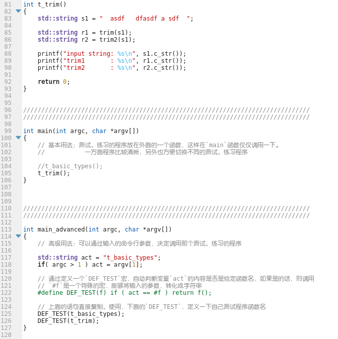

# C++基础

## 1. 学习内容
学习C++的基本语法，练习编写基本的程序，包括：
* 基本的用法，变量、循环、判断、打印
* 函数的定义、调用
* 数组、指针
* 类，面向对象编程
* 文件、IO操作
* STL标准模板类，模板
* 如何使用IDE环境编写、调试程序；或者在Linux下用GCC编译器编译程序

## 2. 要求
请将练习的程序按照类别保存到对应的目录里。编程练习题目可以参考[《编程练习题》](CodePractice.md)

## 3. 学习资料
- 资料（可以使用在线的教程，或者自己找比较合适的）：
    - [C++ 教程](http://www.runoob.com/cplusplus/cpp-tutorial.html) ，通过这个教程快速学会C++的语法等。
    - 如果对自己有更高的要求，可以学习[C++ Primer](https://www.zhihu.com/question/32087709)。不过最好还是用上面普通的教程先把基础知识学好之后，把Stage4的小项目做完之后，再学习C++ Primer更有效率。

## 4. 小技巧
### 4.1 如何在一个程序里，写多个测试、验证代码
具体可以参考[多个测试函数例子](1_basicusage/MultiTestFuctions.cpp)，里面的用法。这样让程序保持清晰、易懂。

## 5. 参考资料

### 5.1 教程

* [C++基础入门](https://gitee.com/andy-upp/linux-cpp-tutorial/blob/master/01.C++%E5%9F%BA%E7%A1%80%E6%95%99%E7%A8%8B/01.C++%20%E5%9F%BA%E7%A1%80%E5%85%A5%E9%97%A8/C++%E5%9F%BA%E7%A1%80%E5%85%A5%E9%97%A8%E8%AE%B2%E4%B9%89/C++%E5%9F%BA%E7%A1%80%E5%85%A5%E9%97%A8.md)
* [C++核心编程](https://gitee.com/andy-upp/linux-cpp-tutorial/blob/master/01.C++%E5%9F%BA%E7%A1%80%E6%95%99%E7%A8%8B/03.C++%E6%A0%B8%E5%BF%83%E7%BC%96%E7%A8%8B/%E8%AE%B2%E4%B9%89/C++%E6%A0%B8%E5%BF%83%E7%BC%96%E7%A8%8B.md)
* [C++提高编程](https://gitee.com/andy-upp/linux-cpp-tutorial/blob/master/01.C++%E5%9F%BA%E7%A1%80%E6%95%99%E7%A8%8B/05.C++%E6%8F%90%E9%AB%98%E7%BC%96%E7%A8%8B/%E8%AE%B2%E4%B9%89/C++%E6%8F%90%E9%AB%98%E7%BC%96%E7%A8%8B.md)

### 5.2 英文的编程练习题

* https://www.w3resource.com/cpp-exercises/basic/index.php
* https://edabit.com/challenges/cpp