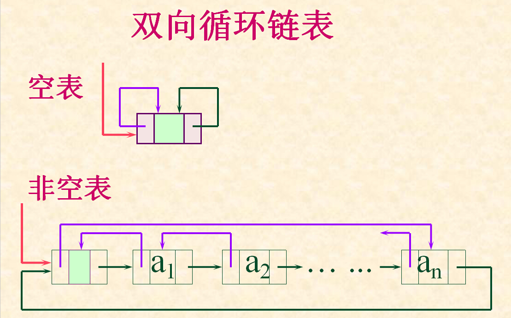

# 链表

链表(linked-list)，就是线性表的链式存储方式。链表的内存是不连续的，前一个元素存储地址的下一个地址中存储的不一定是下一个元素。链表通过一个指向下一个元素地址的引用将链表中的元素串起来。


## 1. 合并两个有序链表

将两个有序链表合并为一个新的有序链表并返回。新链表是通过拼接给定的两个链表的所有节点组成的。 

示例：
```
输入：
链表1:  1->2->4
链表2:  1->3->4

输出：
1->1->2->3->4->4
```


## 2. 反转链表

反转一个单链表。

示例:
```
输入: 
1->2->3->4->5->NULL

输出: 
5->4->3->2->1->NULL
```


## 3. 查找链表中倒数第k个结点

输入一个单向链表，输出该链表中倒数第k个结点。链表的倒数第0个结点为链表的尾指针。

示例:
```
输入: 
5->6->2->10->3->NULL

要求：倒数第2个元素

输出: 
10
```

进阶：
* 考虑是否能对链表遍历一遍完成任务？


## 4. 双向循环链表的队列

构建双向循环链表，其中的存储的数据为整数，按照大小顺序保存，需要有一个指针记录队列的首位置。

要求：
* 编写插入函数：新的数据插入的时候，自动按照新数据的大小插入到正确的位置
* 编写取出函数：取出当前双向循环链表中最小的那个数据


注：双向链表在每一个节点添加了一个指向前驱结点的指针；双向循环链表是将最后一个结点的后继指针指向头结点，表头节点的前驱指针指向最后一个节点。示意图如下图所示：



示例：
```
按照插入顺序插入双向环形链表：
3, 10, 54, 23, 50, 8, 2, 40

构建的双向循环链表为：
  ----------------------------------
  |                                |
  2 = 3 = 8 = 10 = 23 = 40 = 50 = 54
  |                                |
  ----------------------------------

取出数据的顺序为：
2, 3, 8, 10, 23, 40, 50, 54
```

