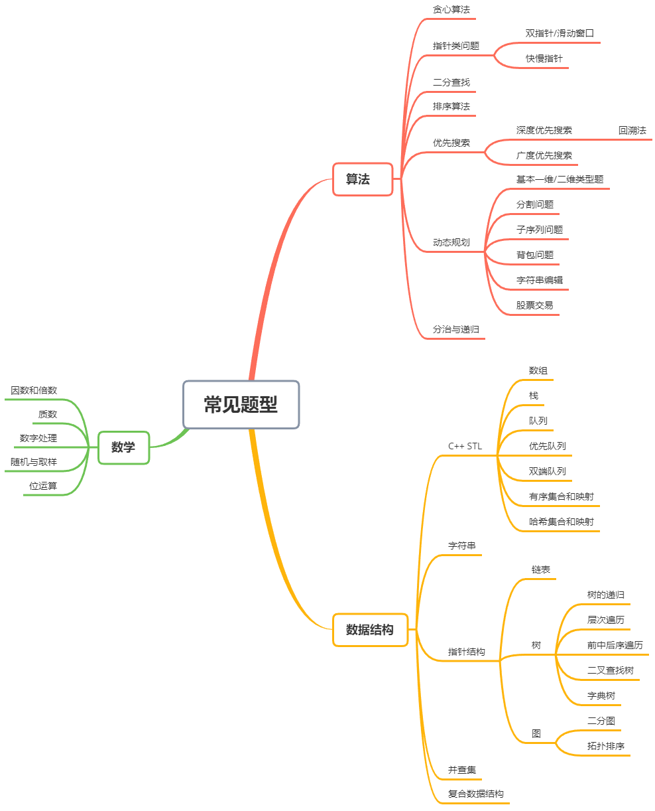

# 算法练习题

为了巩固编程、算法，需要做一些练习题，最少在50道以上。可以根据自己的能力，选择如下的练习来完成
* [初级算法 - 帮助入门](https://leetcode-cn.com/explore/interview/card/top-interview-questions-easy/)
* [中级算法 - 巩固训练](https://leetcode-cn.com/explore/interview/card/top-interview-questions-medium/)
* [高级算法 - 提升进阶](https://leetcode-cn.com/explore/interview/card/top-interview-questions-hard/)

将编写的程序按照类别等存放在这个文件夹。

## 1. 练习的建议

打开 LeetCode 网站，按照题目类型数量分类，最多的几个题型有数组、动态规划、数学、字符串、树、哈希表、深度优先搜索、二分查找、贪心算法、广度优先搜索、双指针等等。**这部分是重点练习的对象。**

* 第一个大分类是算法，可以先从最简单的贪心算法开始，然后逐渐进阶到二分查找、排序算法和搜索算法，最后是难度比较高的动态规划和分治算法。

* 第二个大分类是数学，包括偏向纯数学的数学问题，和偏向计算机知识的位运算问题。这类问题通常用来测试你是否聪敏，在实际工作中并不常用，建议可以优先把精力放在其它大类上。
* 第三个大分类是数据结构，包括 C++ STL 内包含的常见数据结构、字符串处理、链表、树和图。其中，链表、树、和图都是用指针表示的数据结构，且前者是后者的子集。**这部分是重点练习的对象。**

## 2. 参考资料

* [LeetCode 101](https://github.com/changgyhub/leetcode_101) : 如果遇到实在不会的，可以参考里面的解题思路
    * [LeetCode Note](https://github.com/changgyhub/notes/tree/master/leetcode)

