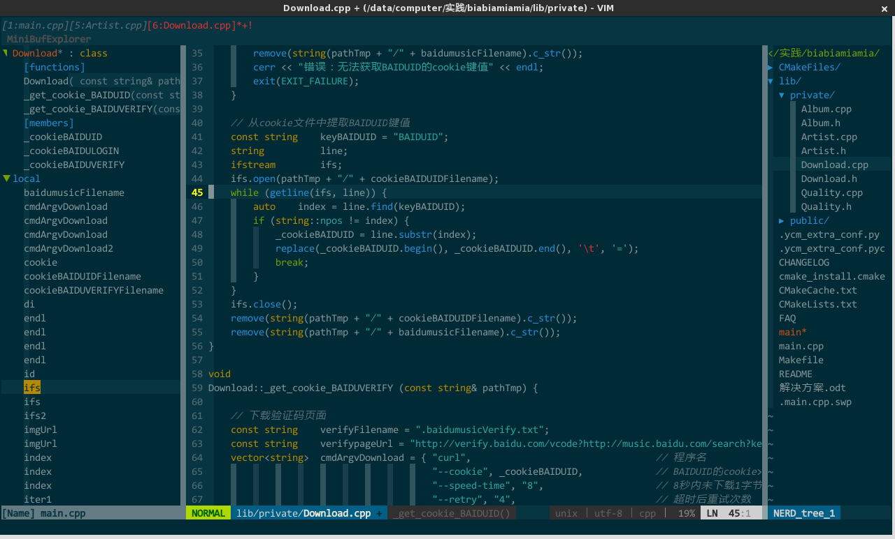

### Markdown 与 Latex 简单介绍

简单给大家介绍一下 Markdown 的使用，以及 Latex 的一些知识

[TOC]

### Markdown

一种轻量级的文本标记语言,通过简单的标记可以自动对文档进行简单的排版

#### 一．软件

> 工欲善其事必先利其器 !

Markdown 的常用软件较多，但是家里没有矿 :moneybag: ，没钱买不起付费的．．．．so 找 :free: 的呗 ！

比较好用的软件有如下这些：

+ `atom`  Github自己开发的编辑器，对 github 的 Markdown 语法支持较好
+ `vscode` 微软家开发的文本编辑器，与 VisualStudio风格较为相似
+ `vim` 喜欢折腾的大佬们可以随意，改装前就是一个二手奥拓，改装好了就成了:car: `AE86`
+ `gedit` 简单点，自带的编辑器也还不错
+ `cmd_markdown` 支持离线和在线，多系统很方便
+ `马克飞象` 家里有:mountain:的请随意，手动@ :man:


`vim`改造前：

`vim`改造后：




__重头戏__ ：

`Typora` :


> 软件的安装请自行百度，安装过程中可能会报个错，重新安装一下那个依赖库就好．

```bash
sudo apt-get reinstall libxxx #名字忘了,重新安装即可
```


---


#### 二．基础知识

##### 1. Markdown 的原理

最终显示效果 `html`+ `css` ，将Markdown 文件内的标记解析成对应的 `html` 内容，便可以显示出想要的效果，之后配合`css`的一些渲染，同样的`html`可以得到不同样式的效果．

```html
<h1>This is a heading</h1>
<h2>This is a heading</h2>
<h3>This is a heading</h3>
```

##### 2. Markdown 标题

```markdown
# 一级标题
## 二级标题
### 三级标题
#### 四级标题
```

##### 3. 引用

```markdown
> 引用示例
```

> 实际效果就是这样

##### 4. 块引用

```markdown
>块引用实例
>第二行
>第三行
```

>块引用实例
>第二行
>第三行

##### 5. 列表

```markdown
有序列表
1. Red 
2. Green
3. Blue
无序列表
>可用符号为: + - *
+ Red
+ Green
+ Blue
	- blue1
	- blue2
	- blue3
```

有序列表

1. Red 
2. Green
3. Blue
无序列表

>可用符号为: + - *
+ Red
+ Green
+ Blue
  - blue1
  - blue2
  - blue3

---

##### 6. 代码块

主要作用是完成 markdown 中的代码高亮显示,一些例子如下:

```markdown
​```c
float FastInvSqrt(float x) {
  float xhalf = 0.5f * x;
  int i = *(int*)&x;         // evil floating point bit level hacking
  i = 0x5f3759df - (i >> 1);  // what the fuck?
  x = *(float*)&i;
  x = x*(1.5f-(xhalf*x*x));
  return x;
}
​```
```

```c
float FastInvSqrt(float x) {
  float xhalf = 0.5f * x;
  int i = *(int*)&x;         // evil floating point bit level hacking
  i = 0x5f3759df - (i >> 1);  // what the fuck?
  x = *(float*)&i;
  x = x*(1.5f-(xhalf*x*x));
  return x;
}
```

```python
import numpy as np
import matplotlib.pyplot as plt

x = np.arange(0, 5, 0.1);
y = np.sin(x)
plt.plot(x, y)
```


---

#### 三．高级功能

##### 1. 任务列表(TODO list)

```markdown
> [x] 中间没有空格
- [ ] c++
- [ ] cv
- [ ] mvg
- [ ] optimazation
- [ ] state estimation
- [ ] tools
- [ ] python
```

- [x] c++
- [ ] cv
- [ ] mvg
- [ ] optimazation
- [ ] state estimation
- [ ] tools
- [x] python

---

##### 2. 数学公式

`行内公式`

```markdown 
行内公式 $E=mc^2$ 示例
```

行内公式 $E=mc^2$ 示例

```markdown
$$ 
\mathbf{V}_1 \times \mathbf{V}_2 =  \begin{vmatrix} 
\mathbf{i} & \mathbf{j} & \mathbf{k} \\
\frac{\partial X}{\partial u} &  \frac{\partial Y}{\partial u} & 0 \\
\frac{\partial X}{\partial v} &  \frac{\partial Y}{\partial v} & 0 \\
\end{vmatrix}
$$
```

$$
\mathbf{V}_1 \times \mathbf{V}_2 =  \begin{vmatrix} 
\mathbf{i} & \mathbf{j} & \mathbf{k} \\
\frac{\partial X}{\partial u} &  \frac{\partial Y}{\partial u} & 0 \\
\frac{\partial X}{\partial v} &  \frac{\partial Y}{\partial v} & 0 \\
\end{vmatrix}
$$

---

##### 3. 表格

```markdown
基本表格
| First Header  | Second Header |
| ------------- | ------------- |
| Content Cell  | Content Cell  |
| Content Cell  | Content Cell  |

对齐操作
| Left-Aligned  | Center Aligned  | Right Aligned |
| :------------ |:---------------:| -----:|
| col 3 is      | some wordy text | $1600 |
| col 2 is      | centered        |   $12 |
| zebra stripes | are neat        |    $1 |
```

| 姓名 | 电话  | 成绩 |
| :---- | :-----: | ----: |
| 张三 | 12232 | A    |
| 李四 | 110   | B    |
| 狗蛋 | 120   | C    |

---

##### 4. 脚注

```markdown
脚注释示例[^上方标注]
line1
line2
line3
[^上方标注]:标注的内容
```

脚注释示例[^上方标注]

[^上方标注]: 标注的内容

---

##### 5. 和谐的分割线

```markd
*** 或者 ---
line1
***
line2
```
内容

---
内容

---

##### 6. Table of Contents(TOC)

生成当前文档的目录以及对应的链接

```markdown
[TOC] github不支持该语法
```

---

##### 7. 链接

```markdown
行内链接[百度](http://www.baidu.com)
```

行内链接[百度](http://www.baidu.com )

---

#####  8. 引用链接

```markdown
This is [an example][id] reference-style link.

Then, anywhere in the document, you define your link label like this, on a line by itself:

[id]: http://www.baidu.com/  "Optional Title Here"
```

This is [an example][id] reference-style link.

Then, anywhere in the document, you define your link label like this, on a line by itself:

[id]: http://example.com/  "Optional Title Here"

```markdown
[Google][]
And then define the link:

[Google]: http://google.com/
```

[Google][]
And then define the link:

[Google]: http://google.com/

---

##### 9. URLs

```markdown
<helloworld.com>
```

<www.google.com>

---

##### 10. 插入图片

```markdown


```

---

##### 11. 文本格式

`斜体粗体`

```markdown
*斜体*
**粗体**
***又斜又粗体***
```

*斜体*
**粗体**
***又斜又粗体***

---

`写错了`

```markdown
~~Mistaken text.~~
```

~~Mistaken text.~~

---

`下划线`

```markdown
<u>Underline</u>
```

<u>Underline</u>

---

`Emoji`:smile:

```markd
:smile:
```

:smile: :computer_mouse: :mountain::red_car:

---
##### 12. UML图

少数 markdown 编辑器支持

```markdown
​```sequence
张三->李四: 嘿，小四儿, 写博客了没?
Note right of 李四: 李四愣了一下，说：
李四-->张三: 忙得吐血，哪有时间写。
​```
```

```sequence
张三->李四: 嘿，小四儿, 写博客了没?
Note right of 李四: 李四愣了一下，说：
李四-->张三: 忙得吐血，哪有时间写。
李四->>王五: 你写了吗?
王五->李四: 写个毛线!
```
----

##### 13. 流程图

少数 markdown 编辑器支持

```flow
st=>start: 开始
e=>end: 结束
op=>operation: 我的操作
cond=>condition: 确认？

st->op->cond
cond(yes)->e
cond(no)->op
```


### Latex

专业的排版软件,跟markdown相比就是重量级选手与超次轻量级选手

`Latex`:


`markdown`:


#### 一. Hello LaTeX

学习`c++` 的时候大家都写过`Hello World!`程序,所以Latex 的介绍也从`Hello Latex!`开始:

首先最简单的安装:

> 只要求基本功能,中文支持什么的自己百度去吧

```bash
sudo apt-get install texlive-full
sudo apt-get install texlive-publishers
# 从官网下载最新版本的TexStudio
sudo apt-get install texlive-fonts-recommended #安装字体
```


```latex
% Latex 中注释为%类似于Matlab
\documentclass{article}
%这里是导言区:设置页面大小等性质,会影响后面的document
\title{Hello \LaTeX}
\author{XuLei}
\date{\today}

\begin{document}
\maketitle
\end{document}

```

#### 二. Latex软件

Latex 与 各种发行版本的关系,就仿佛是Linux与各种类型的发行版本一样.下面会有各种类型的tex系统

常用的是CTex,对中文专门定制的.

+ tex文档编辑器: 什么编辑器都可以,但是专用的latex编辑器会有代码补全,提示功能
+ tex编译器: `xelatex` `PdfLaTeX ` `LaTex`
+ pdf阅读器 

#### 三. Latex 简单文档

##### 1.  文档的基本结构

```latex
\documentclass{article}
%......

\begin{document}
\maketitle
\tableofcontents %插入目录

\section{1}
\subsection{1.1}
\paragraphy{Section1.1}
\subsection{1.2}
\section{2}
\subsection{2.1}
\subsection{2.2}
\section{3}

\end{document}
```

#### 2. 数学模式

Latex 涉及到数学相关内容时会进入数学模式,一般有两种,行内模式和行间模式

```latex
\usepackage{amsmath} %数学公式等的标准包
$ $ %进入行内公式模式
\[
%行间公式模式
\]
%也可以
$$

$$ 
%或者
\begin{equation}

\end{equation}
```

`上下标`

```latex
$$
E=mc^2 %上标
$$
$$
a_i %下标
$$
$$
\sum_{i=1}^{j=100}
$$
```

`根号与分式`

```latex
%根号
\sqrt{a}
\sqrt[5][a]
%分式
\frac{1}{2}
```

`别的一些符号`

```latex
\lim\limits_{\Delta x \to 0}
\frac{e^x-1}{x}
```

`矩阵`

```latex
$$ 
\begin{pmatrix} a&b\\c&d \end{pmatrix} \quad
\begin{bmatrix} a&b\\c&d \end{bmatrix} \quad
\begin{Bmatrix} a&b\\c&d \end{Bmatrix} \quad
\begin{vmatrix} a&b\\c&d \end{vmatrix} \quad
\begin{Vmatrix} a&b\\c&d \end{Vmatrix} 
$$
% \quad 数学环境中的空格
```

`希腊字母`

```latex
\alpha
\beta
\gamma
\theta
\sigma
\delta
\LaTeX
```


#### 3. 插入图片和表格

`图片`

`````latex
\usepackage{graphicx}
\begin{document}
\includegraphics[width=0.8\textwidth]{a.jpg}
\end{document}
`````

`表格`

```latex
\begin{center}
\begin{tabular}{|c|c|c|}
\hline
cell &cell2 &cell3 \\
cell &cell2 &cell3 \\
cell &cell2 &cell3 \\
\hline
\end{tabular}
\end{center}
```


```latex
\begin{tabular}{|l|c|r}
\hline %显示水平线
操作系统 &发行版本 & 编辑器 \\
\hline 
Windows &Ctex & WinEdt \\
\hline
Linux  &Texlive & Vim \\
Mac OS ds &MacTex &Teworks\\
通用 &Texlive &Texworks
```


```latex
\begin{tabular}{ |p{3cm}||p{3cm}|p{3cm}|p{3cm}|  }
 \hline
 \multicolumn{4}{|c|}{Country List} \\
 \hline
 Country Name     or Area Name& ISO ALPHA 2 Code &ISO ALPHA 3 Code&ISO numeric Code\\
 \hline
 Afghanistan   & AF    &AFG&   004\\
 Aland Islands&   AX  & ALA   &248\\
 Albania &AL & ALB&  008\\
 Algeria    &DZ & DZA&  012\\
 American Samoa&   AS  & ASM&016\\
 Andorra& AD  & AND   &020\\
 Angola& AO  & AGO&024\\
 \hline
\end{tabular}
```


#### 四. 别的用法

`beamer`

Latex 内置的 ppt 支持包


```latex
\documentclass{beamer}
\usepackage[space,space,hyperref]{ctex}
\usetheme{warsaw}
\author{ddswhu}
\title{First Start}
\begin{document}
\frame{\titlepage}
\begin{frame}[c]\frametitle{frame title}
The context goes here
\end{frame}
\end{document}
```


`cv`