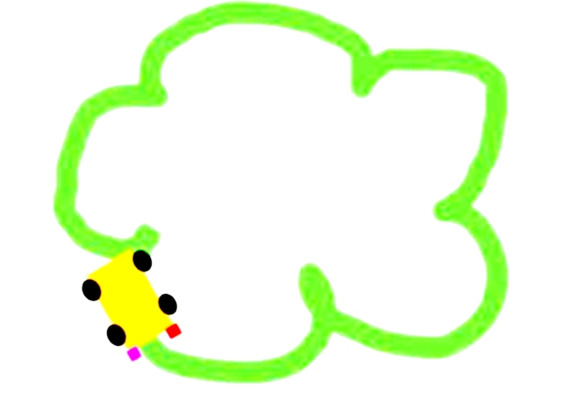
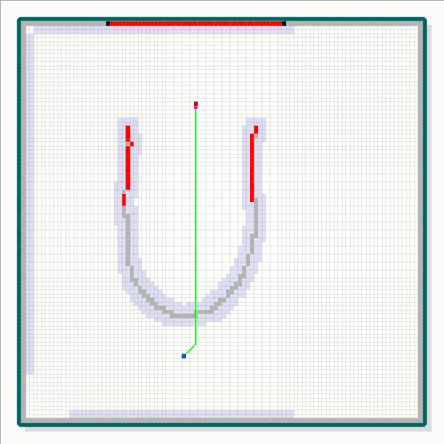
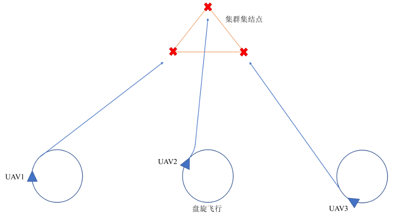
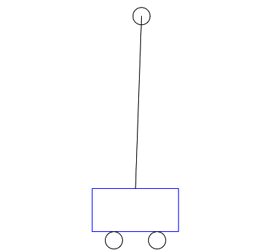
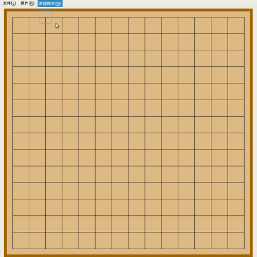
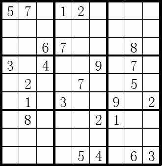
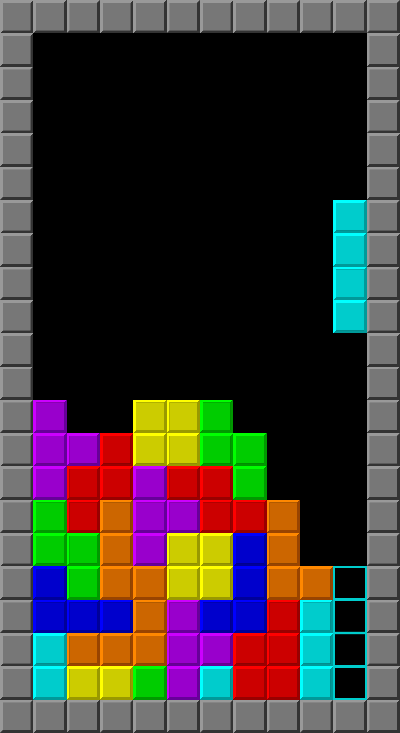
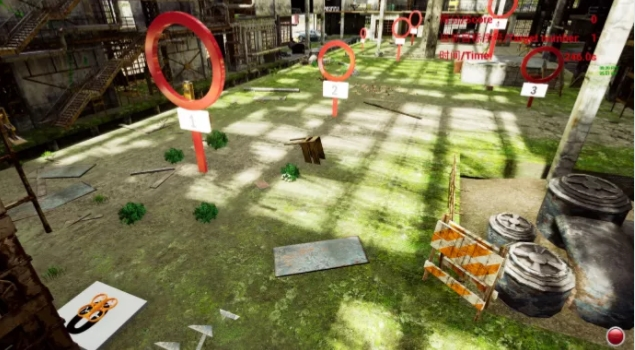

# 综合编程练习项目

完成了前面的编程基础和算法的练习，可以尝试综合运用所学的编程知识去解决一些实际的问题。通过这个综合练习，运用所学的知识解决一个或多个实际的问题，并锻炼系统性解决问题的思路。

## 1. 基础知识与方法

下面的项目需要图形界面，因此需要学习[『Qt』](qt_demos)或者[『SFML』](sfml_demos)程序的编写。具体的学习方法可以如下：

1. 由于综合练习需要学习使用第三方库，而Linux下使用第三方库比较方便，因此建议先花些时间把Linux基本用法学会。具体的教程可以参考： [《Linux教程》](../6_tools/linux/README.md)
2. 先看看[《Qt例子程序》](qt_demos)，或者[《示例项目》](https://gitee.com/pi-lab/code_cook/blob/master/DemoProjects.md)程序，把程序结构、第三方库的用法等学会，然后分析例子程序与自己的程序所需要的功能差距在哪里？如果可以在例子程序的基础上逐步修改得到需要的画图功能，可以一步步从简单画线、画矩形等着手，然后逐步添加更多的功能，直到完成所需的功能为止。
3. 考虑具体的算法应该是什么样？用什么样的数据结构，用哪种算法类型？开始可以不用想的非常完美，只要能把最基础的功能实现即可，在实现基本功能的情况下通过不断的迭代改进，实现最终所需要的效果。下面的项目，可以先把基本的正向功能实现，就是能人操作能够显示、变化、移动等功能。
4. 在完成最基本的绘图和操作等功能之后，再考虑如何自己编程序实现电脑找最优的位置落子等。从而实现电脑玩游戏的功能。
5. 总而言之，不要一上来想一下子做好，而是将项目分解成多个小的任务，通过循环迭代的方式，先把简单的功能实现，然后逐步完成难度更大的功能，最终当一个个问题解决之后再合并起来完成整体的功能。
6. 这个综合练习，主要的目的是通过学习使用库函数、自己设计数据结构、处理算法，解决一个相对比较完整的项目，学习如何处理一个相对复杂的问题。如果具备了这样的能力，之后学习过程所要做的很多事情都是采用类似的思维和方法，因此能够极大的加速后续的学习效率。

## 2. 示例项目

可以参看下面所列的，也可以自己想一个去实现。更多示例项目可以参考[《示例项目》](https://gitee.com/pi-lab/code_cook/blob/master/DemoProjects.md) （可以先看看示例项目，了解一下要做成什么样子，自己还缺那些知识、技能）

### 2.1 模拟自动巡线的智能小车
研究如何模拟摄像头的工作原理，构建一个虚拟的环境，在虚拟的地面有黑色的轨迹，通过虚拟相机拍摄的画面，来识别黑色轨迹，然后控制小车的移动。

具体要求：
* 需要思考如何模拟环境、地面、黑色轨迹线
* 需要考虑如何构建小车的模型
* 使用Qt来编写可视化界面，能够显示仿真环境，相机看到的画面，控制指令等

### 2.2 [无人机路径规划](https://gitee.com/aircraft-is-design/aircraft-information-system-design/blob/master/project-uav-planning/README.md)
目前无人机虽然实现了自动飞行，但是大部分的无人机仍不具备感知环境、动态适应环境的能力。本课题通过一步一步实现无人机的感知、路径规划、仿真，通过本项目理解无人机系统的感知、控制。需要设计开发一套仿真、控制系统，具体效果如下图所示。

具体要求：
* 让无人机从红色的起点出发，朝向蓝色的终点飞行，但是事先不知道环境地图（障碍物）的分布
* 假设无人机上装备了激光雷达，能够探测一定范围内的障碍物信息
* 在飞行过程探测周围环境，不断完善环境地图，并不断更新规划路径
* 无人机利用A * 算法规划当前认为可行的路径，绿色的线段
* 更具体的说明见 [无人机路径规划](https://gitee.com/aircraft-is-design/aircraft-information-system-design/blob/master/project-uav-planning/README.md)

### 2.3 编队无人机的集结
研究多架**固定翼**无人机从任意位置出发，形成编队，如下图的示意。刚开始多架无人机在空中特定的位置盘旋，接收到编队集结命令之后，多架固定翼无人机朝指定的集结地点出发，最终按照相同的速度与方向同时到达。

具体要求：
* 需要考虑固定翼无人机的运行特性，假设无人机的最小转弯半径能够达到300m，其他无人机参数可以自己假设
* 固定翼无人机的动力学仿真，如果不会可以用简单的模型来仿真，另外可以找相关的程序借鉴。
* 需要考虑从任意位置到指定集结地点的曲线轨迹
* 在生成曲线轨迹的基础上，如何生成控制固定翼无人机的飞行指令 （可以用最简单的方式：接下来需要达到的航点，飞行速度），并把飞行指令可视化出来
* 使用Qt来编写可视化界面，能够可视化固定翼无人机飞行过程的位置变化，机头朝向

### 2.4 多旋翼无人机自主降落
模拟多旋翼无人机利用视觉定位实现自主降落的仿真系统。

主要的内容包括：
1. 模拟多旋翼无人机运动，可以使用最简单的模型，假设为一个质点
2. 模拟相机拍摄降落地点的标识，例如一个二维码或[ArUco](https://docs.opencv.org/master/d5/dae/tutorial_aruco_detection.html)
3. 如何识别二维码，如何解算相对位姿
4. 如何控制多旋翼无人机逼近Marker

### 2.5 集群无人机的4D轨迹规划
编写程序模拟多架无人机在空中编队飞行，在空中展现出不同的形状，例如一字形、人字形等等。

* 在不同的时刻，每个无人机在不同位置，然后通过运动变换形状
* 考虑如何将无人机的三维分布可视化出来
* 运动过程，如何考虑无人机的机动能力（例如最大飞行速度）
* 规划的航线如何避免相撞
* 参考资料和示例： [无人机编队灯光秀幕后大揭秘（上）](https://www.bilibili.com/video/BV1oV411E7BK)，[无人机编队灯光秀幕后大揭秘（下）](https://www.bilibili.com/video/BV1YK4y1d7NC)

### 2.6 倒立摆的仿真与控制
研究倒立摆的控制原理，并实现一个图形化的仿真程序。

具体要求：
* 使用Qt编写可视化的界面，能够显示底部的滑动部分，倒立摆，绕动，控制变量等
* 控制算法的输入、参数等需要设计好
* 能够在可视化界面，用鼠标等给予饶动

### 2.7 五子棋程序
如何自己编写一个自动下五子棋的程序，思考编写这样的程序需要什么样的技术，需要什么算法，如何保存棋盘的状态，如何有效判断在何位置下子最好，在实现基本游戏的基础上，研究如何让计算机来自动玩这个游戏。

具体要求：

* 使用Qt来编写可视化界面，学习Qt的绘图，鼠标操作事件等
* 为了实现自动下五子棋，是否需要先把基本的五子棋程序实现？
* 如何显示棋牌？如何保存我方、对方所下的棋子？
* 研究游戏的基本规则，并编程实现
* 怎么才能让电脑计算出落子的最优位置？
* 是否可以实现两个自动下棋的算法，然后让两个算法对弈

### 2.8 数独程序
如何自己编写一个数独的自动程序。

* 如何显示数独的界面？
* 怎么进行推测，尝试，回退等操作

### 2.9 俄罗斯方块
研究如何实现一个俄罗斯方块的程序，能够用光标来控制下降，左右移动。在实现基本游戏的基础上，研究如何让计算机来自动玩这个游戏。

* 设计游戏界面，如何读取键盘的按键输入
* 如何实现记分
* 使用Qt来编写可视化界面，学习Qt的绘图，键盘事件的获取
* 研究游戏的基本规则，并编程实现
* 如何判断哪里落方块比较好
* 研究如何自动来控制方块的下落，并对比分析不同方法的特点

### 2.10 多旋翼无人机钻圈

识别红色的圈、并结合VINS识别的位置，实现无人机穿红色的圈。可以先实现仿真环境下的运行，然后有条件在真机下实现所有的功能。

* 构思仿真环境的搭建，可以使用Gazebo，或者AirSim

* 实现识别颜色圆环的代码

* 根据颜色圆环生成飞行策略

* 学习MAVROS，控制无人机的飞行

* 将颜色圆环的识别程序与控制程序整合，实现多旋翼无人机钻圈的功能

    

## 3. 关于GUI界面

通过自己查找合适的资料、教程学习如何编写一个图形化的界面，从而方便进行交互。建议的方法是，找到一个类似的实例程序，通过不断的修改，将demo程序改造成你所设想的样子。

* [《示例项目》](https://gitee.com/pi-lab/code_cook/blob/master/DemoProjects.md)
* Qt
    - [Qt例子程序](qt_demos)
    - [Qt学习资料](https://gitee.com/pi-lab/resources/tree/master/books/qt)
* [SFML](https://github.com/SFML/SFML)
    - [SFML例子程序](sfml_demos)
    - [SFML学习资料](https://gitee.com/pi-lab/resources/tree/master/books/sfml/SFML-2.5.1_doc)

## 4. 代码重构

完成上述一个或者多个小项目的程序编写，并能解决实际问题。大部分情况下，第一次写完的程序，虽然已经实现了功能，但是往往存在如下的问题：
* 程序命名不规范
* 逻辑、功能比较混乱，代码不够清晰
* 文件组织混乱，代码、数据等混杂
* 程序里有很多固定的路径、常熟等，不方便移植，无法在其他人的电脑上运行

为了更进一步提升自己的编程能力，需要通过多次的代码重构提升自己的综合能力。建议仔细阅读[《代码重构》](../5_advanced/README.md)，并对自己编写的程序进行改进。

## 5. 其他练习项目

* [精选 22 个 C++ 项目，推荐新人练手首选！](https://zhuanlan.zhihu.com/p/86779615)

