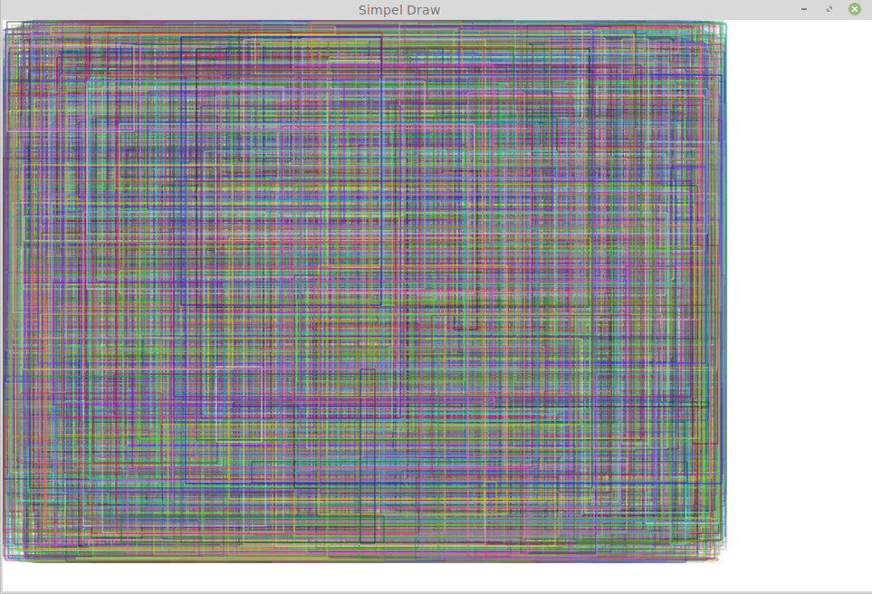

# Simple draw of Qt

这个程序演示一个最简单的Qt画图程序，能够在这个程序的基础上编写自己所需要的画图程序。

## 1. 编译
这个程序运行在Qt4环境下，如果没有安装Qt4，可以通过以下命令安装Qt4。强烈建议在Linux编译这个程序，Windows下，需要自己去找资料如何安装Qt库。
```
sudo apt-get install libqt4-dev libqt4-opengl-dev
```


编译过程：
```
qmake-qt4 simple_draw.pro
make
```

## 2. 使用方法

编译后如果不出现意外的话，会有一个可程序程序`simple_draw`，运行的方法为：
```
./simple_draw
```

程序运行界面：


按键：
```
o - 随机画1000个彩色的矩形，
    绘图函数在：mainwindow.cpp: line 44 
    void MainWindow::keyPressEvent(QKeyEvent *event)
    
c - 清空画板，使用给定的颜色
    绘图函数在：mainwindow.cpp: line 63
    void MainWindow::keyPressEvent(QKeyEvent *event)

q - 退出程序
    代码在：mainwindow.cpp: line 69
```

## 3. 程序的基本结构
这个程序没有直接用`MainWindow::paintEvent`来完成画图，而是创建了一个后台的图像。所有的绘图操作先画在这个后台图像，然后等窗口重绘的时候，将后台图像绘制到窗口上。

主要的流程：
1. `MainWindow::MainWindow(QWidget *parent)` 完成窗口的初始化，创建后台画图的图像
2. `void MainWindow::keyPressEvent(QKeyEvent *event)` 接收键盘的按键，并完成对应的操作
3. `void MainWindow::paintEvent(QPaintEvent * /* event */)` 将后台图像绘制到窗口上

