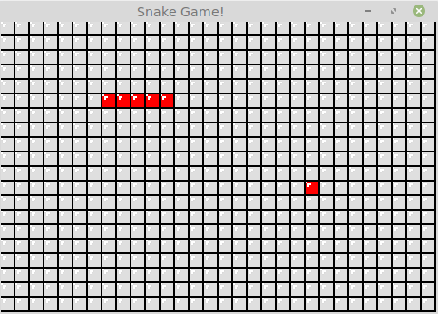

# SFML demo - Snake

## Install dependencies on Ubuntu:
```
sudo apt-get install libsfml-dev
```


## Basic usage of Linux
Linux的基本用法可以参考 [Linux教程](../../../6_tools/linux/README.md)


## Compile the code:
```
g++ main.cpp -lsfml-graphics -lsfml-window -lsfml-system
```


## Key
```
UP    - change direction of snake to up
DOWN  - change direction of snake to down
LEFT  - change direction of snake to left
RIGHT - change direction of snake to right
```


## Screenshot

