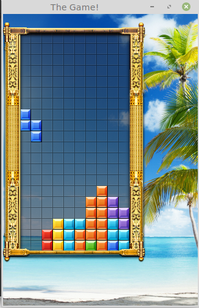

# SFML demos

## 简介

SFML是一个简单易用的GUI图形库，能够方便地编写具有绘图、键盘相应功能的程序。比较快速的学习方法是，通过示例程序来学习如何使用这个图形库。主要的学习步骤是：

1. 由于Linux下编译这个程序比较方便，因此强烈建议先简单的学习一下如何使用Linux，具体的教程可以参考： [Linux教程](../../6_tools/linux/README.md)
2. 编译、运行例子程序。建立直觉的认识，看看例子代码，了解基本的程序流程、函数
3. 构思自己所写的程序和例子程序的差异，想想如何在例子程序的基础上修改。如果遇到不会的地方，可以尝试查阅资料： [SFML学习资料](https://gitee.com/pi-lab/resources/tree/master/books/sfml/SFML-2.5.1_doc)
4. 不要想一次把程序写完美，可以逐步完善，每次添加一个功能，直到主要的功能完成。大体完成之后，再查资料、或者讨论，将程序最终完善。


## Demos

Tetris:

 


Snake:

 

## Install dependencies on Ubuntu:

```
sudo apt-get install libsfml-dev
```

## Compile the code:

```
g++ main.cpp -lsfml-graphics -lsfml-window -lsfml-system
```
