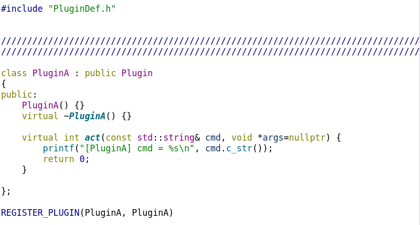
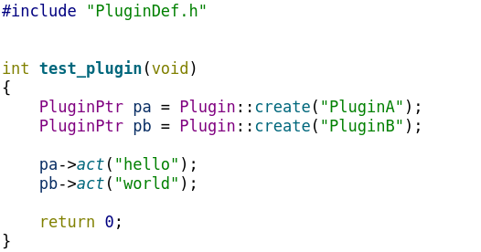

# Plugin Demo

这个程序演示了如何使用C++的插件，编译和具体用法如下解释。


## 1. 编译与使用
### 1.1 安装依赖（建议使用Ubuntu 18.04或者以上版本）

```
sudo apt-get install build-essential g++ cmake git
sudo apt-get install libqt4-dev qt4-qmake
```

### 1.2 编译运行
```
mkdir build
cd build

qmake-qt4 ../Plugin.pro
make

./PluginDemo
```


## 2. 插件系统设计详解


### Step1: 定义插件的基类，定义接口函数

例如
```c++
	virtual int act(const std::string& cmd, void *args=nullptr) { return 0; }
```


### Step2: 实现插件基类的工厂函数

```C++
	static PluginPtr create(const std::string& pluginName);
```


### Step3: 实现自己的插件类

从插件基类继承，并重载接口函数等，然后通过`REGISTER_PLUGIN`宏注册插件




### Step4: 使用

调用插件基类的工厂函数`create`函数，并将所需要的插件名字作为参数传入


