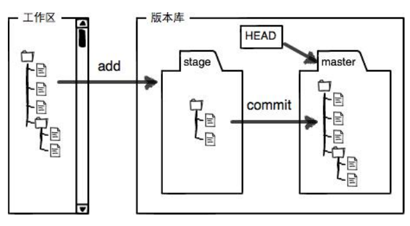
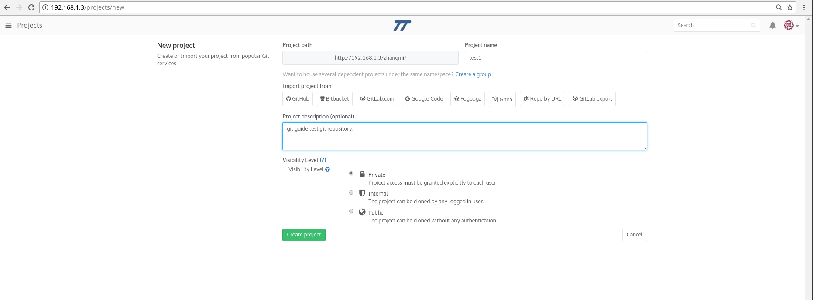
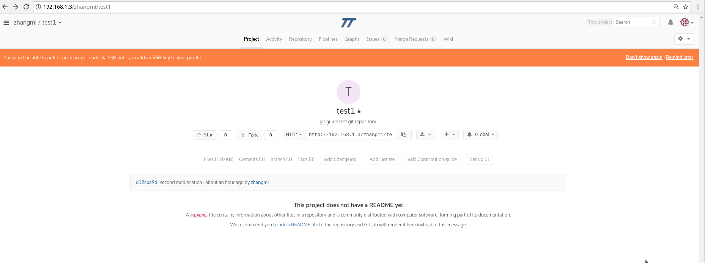

# Git

## 1. 概述
首先，在学习git之前要明确几个概念。

**1.1. git是什么？**

git是分布式版本控制系统。用于敏捷高效地处理任何或小或大的项目版本管理。

**1.2. 什么是版本库**（又称仓库，repository，以下将统一称为仓库）?

简单来说，是一个目录。此目录里面所有的文件都被git管理，每个文件的修改、删除等一些操作都能被git跟踪，随时可以追踪历史，或者可以“还原”到原来任何的版本。

**1.3. 何为本地git仓库？**

很显然，本地指的是自己的机器（电脑），即在自己的电脑上创建的被git管理的目录。

**1.4. 何为远程仓库（远程库）？**

实际上，会有一台电脑充当“服务器”，其他人从这个“服务器”仓库克隆（git clone）一份到本地机器上，并且可以把自己的提交推送到服务器仓库，也可以从服务器仓库拉取别人的提交到本地机器。此服务器仓库就是所谓的远程仓库。常用的如[github](https://github.com),我们实验室则统一用[实验室服务器gitlab](http://192.168.1.3)管理实验室的代码。

## 2. 学习目标与学习方法

**2.1. 目标**

掌握Git的基本用法，能熟练的利用git管理代码。

**2.2. 方法**

本文的单独行列出的终端命令基本按照步骤顺序，并且基本都是新介绍的命令。建议练习时根据本教程内容顺序进行操作。如果出现什么问题请及时找度娘、google或者大神师兄师姐。大家也可以一起探讨解决方案。

**2.3. 推荐资料**

[参考教程](https://classroom.udacity.com/courses/ud775/) 

[git教程](./Git教程.pdf)


## 3. 课程内容

了解基本信息后，我们开始进入实践部分。很多的概念会在实践部分介绍，以便理解。
第一步我们先检查自己的电脑有没有安装git.

1. 在终端命令行输入git（PS:以下的命令输入基本都在终端进行）
 
上图表明我的电脑已安装git。若提示git未安装，按照以下命令提示安装。
```
| sudo apt-get install git
```
若提示unable to locate package git，可能是新装的ubuntu系统没有update,输入`sudo apt-get update`命令，再重复命令`sudo apt-get install git`即可。

2. 安装完成后，还需要进行设置，输入命令：
```
| git config --global user.name zhangmi  
| git config --global user.email zhangmm94@163.com
```

此步是自报家门：姓名和邮箱地址。git config命令的--global参数，表明本地电脑所有的git仓库都会使用此配置，当然可以对特定的仓库指定不同的用户名和邮箱。

接下来我们就可以大展身手使用git管理代码了。
一般的，我们会有两种方式来管理代码。下面分别介绍如何操作。（以[实验室服务器](http://192.168.1.3)为例）

### 3.1. 本地仓库到远程仓库

**3.1.1. 创建一个仓库**
```
| mkdir test1
| cd test1
| pwd
```
pwd命令用户显示当前目录。我的电脑上是`/home/zhangmi/test1`	

现在需要把test1这个目录变成git可以管理的仓库：
```
| git init
```
此时仓库建好了，是一个空的仓库。当前目录多了隐藏的.git文件，`ls -ah`命令可以看见隐藏文件。
现在我们要在test1目录下（或子目录）保存一个文件*readme.txt*。我们需要把它真正的放入git仓库。

**3.1.2. 管理git仓库**

在此之前，了解一下隐藏文件.git的作用。其实我们创建的目录test1称为工作区，但.git不属于工作区，它是git的仓库，它存有很多东西，称为stage（或者index）的暂存区，还有git为我们自动创建的第一个分支master,以及指向master的一个指针叫HEAD。
 
上图表述很清楚，要把工作区的文件放到git仓库需要先添加到暂存区。
```
| git add read.txt
```
若有多个文件，并且需要全部添加时，则需要变成命令
```
|git add -A
```
也可以分别添加，比如：
```
| git add file1.txt
| git add file2.txt file3.txt
```
之后，需要将暂存区的所有文件提交到仓库的当前分支(默认为master,如果有别的分支也可以提交，后面分工协作时会讲到)：
```
| git commit -m "add txt file"
```
-m后面引号内的内容是本次提交的说明，可以是任何内容，最好是与此次修改相关的内容。以便从历史记录找到改动的内容。

要随时查看工作区的状态，这条在整个过程中随时可以输入;
```
| git status
```
这时你又修改了一些内容，但是你突然又想改回原来的。用`git status`查看一下发现：
 
通过以下命令可以丢弃工作区的修改（此时是修改后未git add）,把read.txt文件在工作区的修改全部撤销：
```
| git checkout -- read.txt
```
一种是readme.txt自修改后还没有被放到暂存区,现在,撤销修改就回到和版本库一模一样的状态;

一种是readme.txt已经添加到暂存区后,又作了修改,现在,撤销修改就回到添加到暂存区后的状态。

git checkout --file中的“--”很重要，去掉命令含义不同，后面会提到。

如果修改后不小心git add到暂存区，还未提交，则将暂存区的修改撤销掉，可以自己将工作区的修改到满意再添加提交：
```
| git reset HEAD read.txt
```
如果有文件被修改，可以用`git diff`查看修改内容。这时候我们发现修改错了要还原到某个版本,可以先用命令`git log`查看提交历史。
```
| git reset --hard HEAD^
```
此条用HEAD表示当前版本（每个版本指添加提交后的仓库内容），上一个版本是 `HEAD^`，上上一个版本是` HEAD^^`,往上n个版本时 `HEAD～n`

但现在又觉得最新的版本挺好的要回到未来的版本，怎么办？先用`git reflog`查看命令历史，然后得到每一次版本的commit id.用命令：
```
| git reset --hard commit_id
```
这条命令对于恢复之前和之后的内容是通用的，因为commit id是独一无二的。

有时候，我们发现某个文件比如test.txt没用了想删除，一般直接会`rm test.txt`,这时用`git status`查看会发现提示工作区和仓库不一致。

有两种情况。

1）确实从仓库中删除该文件,并直接提交。
```
| git rm test.txt
| git commit -m "delete test.txt"
```
2) 工作区的是不小心误删的，怎么恢复
```
| git checkout -- test.txt
```
git checkout其实是用版本库里的版本替换工作区的版本,无论工作区是修改还是删除,都可以“一键还原”。

**3.1.3. 推送到远程仓库**

首先，你需要注册一个gitlab属于自己的账号（http://192.168.1.3/users/sign_in）

在本地已经有了git仓库，需要在gitlab上创建一个git仓库，并且让这两个仓库远程同步。
这就需要先在gitlab上创建一个新仓库：
 

设置project name与本地创建的目录test1一致（不一致也可以），然后点击“create project”后，在刚才的test1目录下的终端输入命令：
```
| git remote add origin http://192.168.1.3/zhangmi/test1.git
```
命令后面的地址是你自己在远程创建仓库后有的一个地址，如下图；
 
origin是推送的远程库的默认名字，可以改成别的，如果要改成别的，命令中的origin都要换成你自己要起的名字。

如果自己创建的远程库不需要了怎么办？

```
git remote remove zhangmi（zhangmi是我自己创建的远程库名称）
```

上一条命令是将本地仓库和远程仓库关联起来，还需要把本地仓库的所有内容推送到远程库上：
```
| git push -u origin master
```
针对http地址而言，此条命令每次都要输入你的账号的用户名和密码。记好了！（我自己老忘记每次都要输错好多遍TT）

此命令是把当前分支master(如何知道是哪个分支？可以看到终端test1 git:(master)有个括号里的红色字母就是当前分支,或者git status会出现分支名)

由于远程库是空的,我们第一次推送 master 分支时,加上了 -u 参数,Git不但会把本地的master分支内容推送的远程新的master分支,还会把本地的master分支和远程的master分支关联起来,在以后的推送或者拉取时就可以简化命令。

然后就可以发现gitlab页面中的远程库内容和本地仓库一模一样。

在本地仓库修改后,不断的添加，提交，再通过命令：
```
| git push origion master
```
就可以不断地把本地的master分支的最新修改推送到远程仓库。

origin后面的分支名指的是本地的分支名，上面的命令要推送到的远程库的分支名是省略的，其实正常的写法应是：
```
| git push origin 本地分支名:远程分支名
```
比如：git push origin master:master。

有人可能会问，为什么有时候会看到`git push`就可以，`git push origin master`的意思是上传本地当前master分支的代码到master分支。在Git 2.0版本之前`git push`默认是上传本地所有分支代码到远程对应的分支上.但2.0版本之后`git push`默认仅仅是将当千分支推送到远程有相同名字的对应的分支上。当然默认这个东西就说明这是可以设置的，具体请参照`git help config`关于push.default的设置。

可是，有时候我们需要把别人的代码从远程库拉取到本地的某个目录下，在进行修改。这时候要怎么做呢？这就涉及到第二种方式了。

### 3.2. 远程仓库到本地仓库##

首先，我们需要把远程仓库的最新代码克隆下来(此命令在你所要存放代码的目录下的终端运行，比如我要放在/home/zhangmi下，打开/home/zhangmi下的终端输入命令，那么克隆的代码路径为：/home/zhangmi/test1)：
```
| git clone　http://192.168.1.3/zhangmi/test1.git
```
后面的远程git仓库地址依然可以在网页界面中看到。

这时候你输入其它的命令要切换到目录/home/zhangmi/test1终端下。你现在修改完毕后准备需要在远程库同步最新内容，直接添加提交再推送到远程库就可以了。

每次提交git都把串成一条时间线，这条时间线就是一个分支，只有你一个人对自己的代码进行操作时，只有一个默认分支master,称为主分支，按照上面命令推送就好。HEAD严格来说不是指向提交,而是指向master,master才是指向提交的,所以,HEAD指向的就是当前分支。

但实际上，一个庞大的代码是需要多人协作的，这时候就需要多个分支。

**3.2.1. 创建新分支**

一开始的时候,master 分支是一条线,Git 用 master 指向最新的提交,再用 HEAD 指向master,就能确定当前分支,以及当前分支的提交点。当我们创建一个新分支时，指向master相同的提交，再把HEAD指向新分支，就表示当前分支为新分支。

比如，我们创建了新分支feature1(注意checkout的使用和上面撤销时的区别)：
```
| git checkout -b feature1
```
以上命令创建了新的分支feature1,并切换到分支feature1上（test1 git:(feature1) )。
修改目录下的内容，在feature1分支上提交：
```
| git add -A
| git commit -m "sth"
```
一定注意，切换分支前添加提交，否则修改的内容会丢失。若修改完毕后没有添加或者只添加未提交都会丢失修改内容。之后切换到master分支：
```
| git checkout master
```
Git 还会自动提示我们当前 master 分支比远程的 master 分支要超前1个提交。

**3.2.2. 合并分支**（注意：已经切换到master分支）

比如现在在master分支下修改了内容，进行添加提交，这样master分支和feature1分支都分别有了新的提交，这时候我们要把各自的修改合并：
```
| git merge feature1
```
注意，这是在master分支下对feature1分支合并，若想将master分支合并到feature1分支，需要将切换到feature1分支`git checkout feature1`,再运行命令`git merge master`.

但是，多个分支下可能对同一个地方做不同的修改，这时合并时会提示有冲突，这种情况下必须手动解决冲突后在提交。`git status`会告诉我们具体是哪里冲突了以便我们解决。

Git 用 <<<<<<<,=======,>>>>>>> 标记出不同分支的内容以便统一修改内容再提交。

用带参数的`git log`可以看到分支的合并情况：
```
| git log --graph --pretty=oneline --abbrev-commit
```
上述合并分支时git会用fast　forward模式，这种模式下删除分支后，会丢掉分支信息,即fast forward合并看不出来曾经做过合并。所以另一种方法合并时多加--no-ff　参数，表示禁用fast　forward,这时git会在merge时生成一个新的commit，可以从分支历史上看出分支信息:
```
| git merge --no-ff -m "merge with no-ff" feature1
```
可以用上面的`git log --graph --pretty=oneline --abbrev-commit`查看分支历史。

现在已经将本地仓库的feature１分支与master分支的内容合并一起。若要将master分支的最新内容推送到远程仓库，之前强调过好几次，添加、提交、推送到远程仓库，非常简单。

如果我们不想要这个分支，就可以直接删除，前提是此分支已经被合并：
```
| git branch -d feature1 
```
那没有还未合并要强制删除怎么办？不需要merge了，直接执行下面的命令：
```
| git branch -D feature1
```

**3.2.3. 推送分支**

但问题是，远程也需要有别的分支，以便每个人做完修改直接不断的推送到远程仓库某个项目自己的分支下，在远程仓库进行合并。

首先，我们可以先查看远程库的信息：
```
| git remote
```
或者显示更详细的信息的命令：
```
| git remote -v
```
执行此条命令会显示可以抓取（fetch）和推送（push）的地址。如果没有推送权限，看不到push地址。

好了回到原题，如何推送feature1分支(删除分支命令需要时再用，我并未按照步骤删除feature1分支)？

之前讲过master分支的推送命令直接是`git push origin master`

照猫画虎，推送其他分支稍作改变即可：`git push origin feature1`

若此时，你在本地又新创建了一个feature2分支，若你在本地feature2分支上做了修改并添加提交但没有做任何合并执行push命令，则远程库会新建一个feature2分支并和本地的feature2分支的所有内容同步；

若你没有做修改或者做完修改没有提交合并则远程库会新建一个feature2分支，此分支下的内容与在本地创建新分支时所在的分支有关，比如：若feature2分支是在test1 git:(master)分支新建的，项目的所有内容与master分支下的相同，若是切换到feature1分支上创建的，则与feature1分支的内容相同。

注意，master分支是主分支，时刻要与远程同步；

其他团队成员的开发分支也需要与远程同步；

如果本地仓库比远程仓库提前（ahead），push时会很顺利，直接push本地的到远程就ok.

但是如果本地仓库比远程仓库落后（behind）,push就会失败，并提醒你需要把本地仓库的内容重新与远程库同步。出现这种提示有两种情况：
**1)**有一个更新还没有反应到本地来，可能是别人往远程库上提交了一点东西。用以下命令把远程库拉取到本地，使本地库更新和远程库同步：
```
| git pull　origin 分支名
```
**2)**有时候我们只是修改错误而且push到了远程库，本地库可以用之前的`git reset --hard HEAD^`进行版本回退，但是现在本地库比远程库落后（behind）了，有个最简单的办法就是强制push：
```
| git push  origin master -f
```
-f参数是强制提交，但是这种办法是非常鸡肋的，因为你一般是没有权限可以强制push到远程库的。而且必须要明白的一件事，任何普通用户不能擅自做有关远程仓库回退的操作，如果你擅自回滚了远程仓库，会对项目团队其他人造成不可预知的影响。如果需要回退版本，先联系项目的仓库管理员，在团队其他人都对自己本地未提交的工作做好备份之后，再进行远程仓库回退操作，操作结束后，团队成员需要重新同步远程仓库后继续自己的工作。
所以请慎重提交到master分支，习惯边改边提交的人务必创建一个自己的分支并推送到远程对应的自己的分支上，这样你自己就有权限强制push了。

说到push，我还尝试了一种可能出现的情况，在master分支下执行`git push origin feature2`,发现只是将本地feature2分支的内容push到远程库对应的fearture2分支上而已。

那要是想把本地master分支push到远程库feature2分支怎么办？用下列命令就大功告成：
```
| git push origin master:feature2
```
注意，push时本地分支和远程分支不是对应名称时，必须把两个分支的名字都写上，‘本地分支:远程分支’，如上条命令。

那么，要是想删除远程库的一个分支feature2就可以直接执行以下命令：
```
| git push origin :feature2
```

**3.2.4. 拉取分支**

上面我们也接触过pull这个指令，那它具体是如何使用什么情况下使用呢？

如果远程库已经存在一个别人推送到远程库的分支feature3，你现在要在feature3分支上开发，就必须clone（本地没有此项目）分支feature3：
```
| git clone http://192.168.1.3/zhangmi/test1.git
```
```
| git pull origin feature3:master
```
此条命令表示取回origin远程主机的feature3分支，与本地master分支合并。在master分支下是可以pull远程库的feature３分支的，前提是内容没冲突，会自动合并，若提示有冲突先手动解决，再pull。这也就是说，本地和远程不同的分支之间其实是可以互相pull的。

如果是与当前分支合并，冒号和后面的内容可以省略。

比如：若存在feature3分支，就可以直接切换到feature3分支，并pull下来如下：
```
| git pull origin feature3
```
如果你需要拉取本地分支下对应的远程分支，可以直接用命令`git pull`即可。如果第一次pull远程库与本地存在的相同名称的分支，比如feature3分支，本地库已经有feature3分支，这时git pull 会提示 “no tracking information”,则说明所要pull的远程分支feature3和本地对应名字分支的链接关系没有创建,用命令 `git branch --set-upstream branch-name　origin/branch-name`,然后再`git pull`.建立了连接关系后，以后就可以直接pull。

若本地库没有feature3分支，则创建远程库的feature3分支到本地：
```
| git checkout -b feature3 origin/feature3
```
在feature3分支上做完修改，再push到远程库相应的feature3分支上。

在git中pull和fetch都可以拉取远程库到本地库。在此，先普及`一个概念,`git pull`和`git fetch`的区别？
pull是拉取远程分支，并且与本地分支合并；fetch只是拉取远程分支，合并与否可以自己选择。

既然说到这，上面讲过的`git clone`是在本地没有远程库项目时类似于copy到本地的新的项目或者直接覆盖原来的同名项目，而pull和fetch都是本地已经存在此项目，相当于不断更新此项目。

有时候，我们pull会提示远程库和本地库有冲突导致pull失败，可是有时就是不想改动，那就直接用下面的命令直接抓取到本地：
```
｜git fetch origin feature3
```
这时你打开本地库的文件就会发现已经标记了冲突内容，尽情的修改后在提交push就可以啦。

有时候，你要把远程库上所有分支的更新全部取回到本地，只需：
```
| git fetch 
```
或者
```
| git fetch origin
```

**3.2.5. 查看分支信息**
```
| git branch -r
```
-r选项可以用来查看远程分支。
```
| git branch -a
```
-a选项用来查看所有分支。

讲到这里，介绍了常用的git命令。

## 4. 其他用法

下面会简略的介绍一下其他的git有关的命令。

**4.1. 标签管理**

发布一个版本时,我们通常先在版本库中打一个标签,这样,就唯一确定了打标签时刻的版本。将来无论什么时候,取某个标签的版本,就是把那个打标签的时刻的历史版本取出来。所以,标签也是版本库的一个快照。

Git的标签虽然是版本库的快照,但其实它就是指向某个 commit 的指针(跟分支很像,但是分支可以移动,标签不能移动),所以,创建和删除标签都是瞬间完成的.
```
| git tag v0.9
```
此条命令用于新建一个标签，默认为HEAD，也可以指定一个commit　id.
```
| git tag -a v0.9 -m "blablabla..."
| git tag -s v0.9 -m "blablabla..."
```
-a参数可以制定标签信息,-s参数可以用PGP签名标签。
```
| git tag
```
此条命令可以查看所有标签。
```
| git tag -d v0.9
```
删除名字v0.9标签.此时还未将标签推送到远程可以在本地安全删除。
```
| git push origin v0.9
```
此条推送某个标签到远程。

或者一次性推送全部尚未推送到远程的本地标签：
```
| git push origin --tags
```
如果标签已经推送到远程要删除远程标签，先要删除本地标签：
```
| git tag -d v0.9
```
然后下面的命令删除远程标签：
```
| git push origin :v0.9
```
**4.2. 自定义git**

在一开始我们设置了用户名和邮件地址，其实还有许多可配置项。
```
| git config --global color.ui true
```
使用`git status`可以查看颜色的变化，具体的可以自己操作查看。

也可以将某些命令起个别名，比如用`git st`代替`git status`。即st代替status:
```
| git config --global alias.st status
```
可以概括为，`git config --global alias.别名　原命令名`。输入命令就可以少敲几个字母了哈哈。常用的替换：
```
|  git config --global alias.unstage 'reset HEAD'
|  git config --global alias.last 'log -1'
| git config --global alias.lg "log --color --graph --pretty=format:'%Cred%h%Creset -%C(yellow)%d%Creset %s %Cgreen(%cr) %C(bold blue)<%an>%Creset' --abbrev-commit"
```
`git unstage`就可以直接撤销修改。`git last`就能显示最近一次的提交。试着执行`git lg`，超炫酷的。加上--global是针对当前用户的所有git仓库，如果不加，就只针对当前仓库。

说到这，你也可以直接查看每个仓库的git配置文件.git/config文件`cat .git/config`,别名就在alias后面。要删除别名，直接把对应的行删掉即可。

当前用户的git配置文件放在用户主目录下的一个隐藏文件.gitconfig中。配置或者删除别名也可以直接修改这个文件。

**4.3. 忽略特殊文件**

有时候我们会有些文件不想提交到远程库，比如代码中的数据库，或者build文件夹等，可以在git工作区的根目录创建一个特殊的.gitignore文件，然后把要忽略的文件名填进去，git就会自动忽略这些文件。
 .gitignore文件本身要放到仓库里,并且可以对.gitignore做版本管理!注意：.gitignore文件是隐藏的，需要`ls -ah`才能在目录看到。下图为一个.gitignore文件。
  

**4.4. 搭建git服务器**（远程仓库）

先准备一台运行linux的机器，通过简单的命令就可以完成安装。
```
| sudo apt-get install git
```
接着创建一个git用户，用来运行git服务：
```
| sudo adduser git
```
然后，创建证书登录。收集所有需要登录的用户的公钥,就是他们自己的id_rsa.pub文件,把所有公钥导入到/home/git/.ssh/authorized_keys文件里,一行一个。

再初始化git仓库。假定是/srv/sample.git，在/srv目录下输入命令：
```
| sudo git init --bare sample.git
```
Git就会创建一个裸仓库,裸仓库没有工作区,因为服务器上的Git仓库纯粹是为了共享,所以不让用户直接登录到服务器上去改工作区,并且服务器上的Git仓库通常都以.git结尾。然后,把仓库项目文件夹sample改为git:
```
| sudo chown -R git::git sample.git
```
接下来禁用shell登录，出于安全考虑，创建的git用户不允许登录shell，这就可以通过编辑/etc/passwd文件完成。找到类似下面一行：
```
|  git:x:1001:1001:,,,:/home/git:/bin/bash
```
改为：
```
|  git:x:1001:1001:,,,:/home/git:/usr/bin/git-shell
```
这样，git用户可以正常通过ssh使用git,但无法登录shell，因为我们为git用户指定的git-shell每次一登录就自动退出。

最后，我们就可以用`git clone`克隆远程仓库。


## 5. 一些常用技巧
请参考[Git技巧](git-tips.md)


## 6. 课程作业
5.1. 将[远程练习项目](http://192.168.1.3/zhangmi/git_test.git)克隆到本地，添加一个自己姓名命名的文件，内容自定,并推送到自己的分支。

5.2. 拉取[远程练习项目](http://192.168.1.3/zhangmi/git_test.git)的master分支，根据远程练习项目README.md里的要求修改，将master分支合并到自己的分支，并推送到远程库上自己的分支。


## References
* [Git教程.pdf](Git教程.pdf)
* [git-cheatsheet.pdf](git-cheatsheet.pdf)
* [Git_remote_branch.pdf](Git_remote_branch.pdf)
* [PI-Lab的Git/Gitlab使用教程](http://192.168.1.3/PI_LAB/Wiki/blob/master/Tools/Git%E4%BD%BF%E7%94%A8%E6%95%99%E7%A8%8B_PILAB.pptx)
