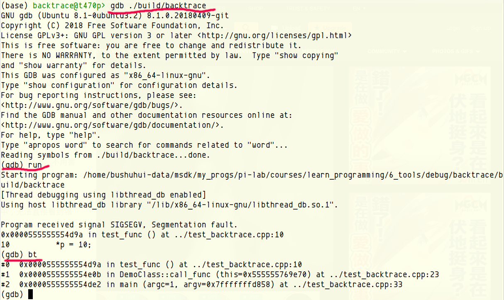
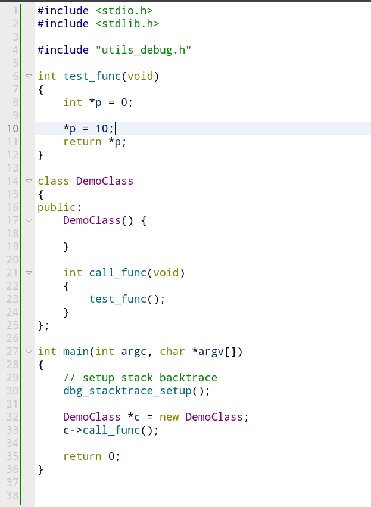
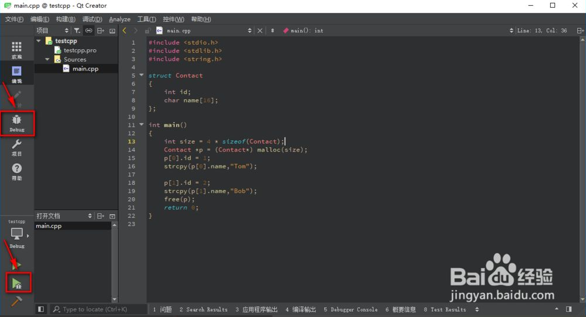
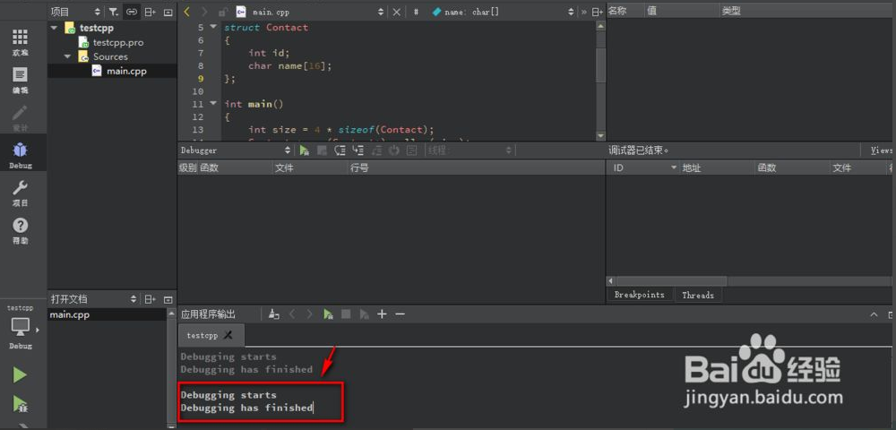
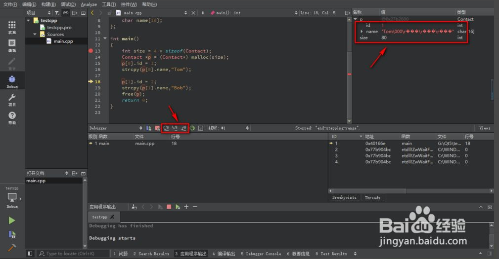
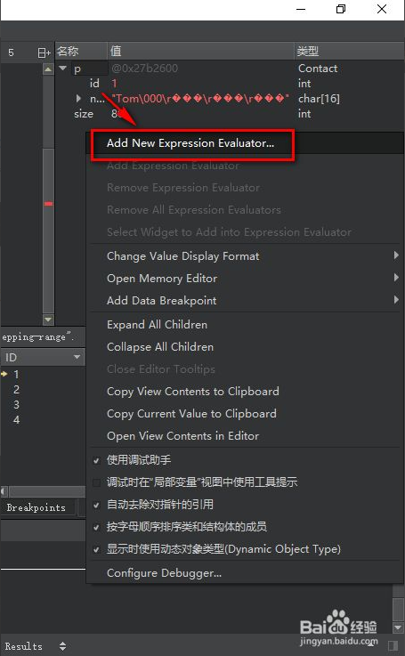
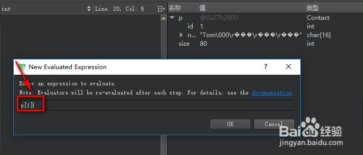
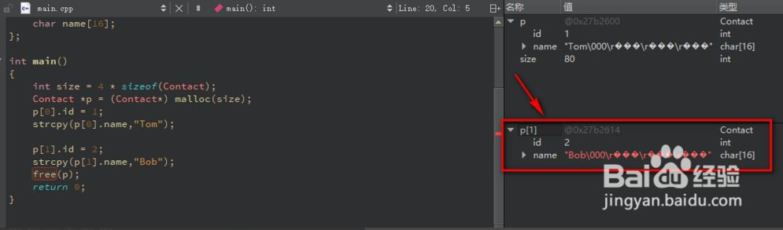

[TOC]

# Debug技巧

如何快速发现程序当中的问题，并找到解决办法，是一项非常重要编程技能。下面列了一些常用的方法，大家可以先了解，在遇到问题的时候，琢磨哪种方法比较适合，以及如何灵活应用并组合多种方法去解决所面临的问题。

## 0. 流程分析/大脑运行代码

其实最快的Debug方式是用自己的大脑运行程序，然后分析各个变量的变化、时序、函数调用关系等等。可能刚开始对程序进行流程分析太难，因为还没有建立起程序分析的能力，因此建议各位强迫自己先从程序阅读分析开始着手。

程序分析的基本思路：

* 程序本质上是一个倒长的树，功能、函数大多数情况下可以细分成更小的函数、模块等。通过层层深入分析的方式能够更好掌握程序的整体的架构，根据程序中模块、类、函数等关系，层层深入进去去看、去分析。
	- 先把`main`里面的调用看完，这时候先不要急着深入进去看不清楚的函数或者类
	- `main`函数都看完之后，然后再逐个模块、类、函数深入进去分析
	- 也就是说采用广度优先的遍历方式去看、去分析代码。

* 类似的，在看当前函数、或者类的时候，先集中精力在所关注的函数、类

	- 它所调用的其他函数、类，需要先假设调用的那些函数、类是符合预期设计。
	- 当看完当前的函数、类之后，在对所调用的函数、类直接的调用关系、参数传递、返回值等进行分析。

   


## 1. backtrace

对于C、C++程序，内存访问异常是最常见的一类问题。遇到程序内存访问异常导致的崩溃，不用害怕，目前编程语言、操作系统、IDE都有很好的支持，能够很快的定位到出现的问题地方。

针对示例程序 [backtrace](backtrace) ，具体的操作包括：

* 编译的时候打开Debug模式，否则编译器不会把源代码、符号编译到程序中，无法直接看到错误地点的代码。针对`qmake`具体的操作是： `qmake backtrace.pro CONFIG+=debug`

* 编译程序，输出的程序在`./build/backtrace`

* 运行`gdb ./build/backtrace`, 然后输入`run`指令执行程序，出错之后输入 `bt`后者`backtrace`指令，能够将调用的堆栈打印出来，可以看到



通过调用堆栈所提供的信息，能够看到最后出错的地方在程序`test_backtrace.cpp`的第10行，从下图可以看出有一个非法的指针赋值。




## 2. 单步跟踪

我们在编程的时候，有些非语法问题可能很难找到定位，这时候我们就需要进行程序的调试工作了。一般我们都会在程序加断点，然后再利用单步调试查看变量的值是否异常。


1 - 我们打开Qt界面程序的主窗口

我们将编辑的窗口切换到Debug的窗口

点击那个甲虫的标志




2 - 下面绿色的播放按钮是编译运行，带甲虫标志的是调试编译运行

在右上角我们可以看到变量值的信息


3 - 不过这时我们发现调试程序也是很快就运行完了

那个变量窗口也是什么信息都没有

那是因为我们没加断点，程序很快就运行结束了




4 - 我们在程序的适当位置添加断点

然后再点击编译运行

发现程序黄色的进度条停止在断点那里

而变量窗口也有我们需要的信息了

我们可以单击下面的单步运行查看变量值的变化是否正确




5 - 我们在变量窗口点击Add 可以添加那里原本没有的变量




6 - 比如我们这里只显示了结构体指针p的值，而没有显示p[1]的值

我们可以输入p[1]，就行了




7 - 可以看到，在变量窗口已经显示出了p[1]的值了



## 3. log文件分析

## 4. 单元测试
`gtest`是一个跨平台的(Liunx、Mac OS X、Windows 、Cygwin 、Windows CE and Symbian ) C++单元测试框架，由google公司发布。gtest是为在不同平台上为编写C++测试而生成的。它提供了丰富的断言、致命和非致命判断、参数化、”死亡测试”等等。

```
TEST(test_case_name, test_name)
TEST_F(test_fixture,test_name) //多个测试场景需要相同数据配置的情况，用TEST_F。TEST_F test fixture，测试夹具，测试套，承担了一个注册的功能。
```

TEST(test_case_name, test_name)

TEST_F(test_fixture,test_name) //多个测试场景需要相同数据配置的情况，用 TEST_F 。TEST_F test fixture，测试夹具，测试套，承担了一个注册的功能。

TEST宏的作用是创建一个简单测试，它定义了一个测试函数，在这个函数里可以使用任何C++代码并使用提供的断言来进行检查。后续文章还会提到TEST_P这个宏，在这里就先不介绍了。

可以参考[示例程序](module_test)，或者更详细的说明
* https://blog.csdn.net/linhai1028/article/details/81675724
* http://www.uml.org.cn/Test/201905061.asp


## 5.Debug工具

`Valgrind`是主要用于检测内存问题的Debug工具，默认使用`memcheck`，可以检测`内存未初始化`，`读取越界`，`动态内存管理错误`等问题。linux下使用apt-get即可安装，非常方便。这里是[入门介绍](https://www.jianshu.com/p/5a31d9aa1be2)和[官网](https://www.valgrind.org/)。

### debug 实例

`stack smash detected`：此为GCC的内存保护机制，一般是内存溢出导致的错误，可以在gdb中使用`where`命令查询并解决。

`多线程中循环的顺序导致的问题`：在未经处理时，多线程的循环顺序是不可控制的，此时会导致跨线程的数据调用出现越界的问题(数组等尤为有可能)，需要人为规范其线程顺序。

`double free detected in tcache2`：重复删除错误，多由于stl容器的`push_back`运作机制导致，该方法会生成对应对象的临时副本，导致产生两个指针指向同一个对象的情况，此时如果调用`delete`（可能并非显示调用，而是C++自动调用）方法则会导致其析构函数删除同一对象两次，导致错误。deemo代码如下:

```c++
std::vector<T> arr_t;	//一个T类的数组
T t;	//生成T类的对象
arr_t.push_back(t);	//将此对象存入数组，此时产生了t的临时副本，并会导致在delete时产生错误
```

解决办法：1.使用T类的指针创建T类的指针数组而非对象数组，即`std::vector<T*> arr_t;`，此时`arr_t`中存储的为指针，对象仅有一个，不会导致重复删除。(已验证)

2.保证复制时的对象是独立的（即杜绝两个指针指向同一对象的情况）。可以使用`pusk_back`以外的复制方法，或者智能指针。[参考这里](https://blog.csdn.net/weixin_44410537/article/details/112260666)(听起来可行)

3.在类内部阻止拷贝构造函数的非期望调用（即阻止产生临时对象，即可阻止产生额外的指针）。[参考这里](https://blog.csdn.net/alxe_made/article/details/96184209)(或许有用，有待验证)


## 6. 参考资料
* [段错误(segmentation fault )：9种实用调试方法](https://m.toutiaocdn.com/i6833639010007515659)

