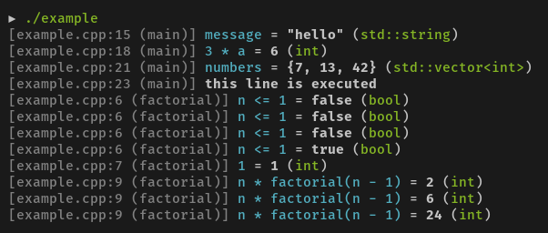

# dbg-macro

[dbg-macro](https://github.com/sharkdp/dbg-macro) : 兼容 C++11 的 header-only 单个头文件的打日志方式调试库。它提供了比 printf 和 std::cout 更好的宏函数。特点：

- 美观的彩色输出
- 支持基础类型和 STL 容器类型的输出
- 除了基本信息外，还输出变量名和类型


输出：



使用方法：
```C++
#include <vector>
#include <dbg.h>

// You can use "dbg(..)" in expressions:
int factorial(int n) {
  if (dbg(n <= 1)) {
    return dbg(1);
  } else {
    return dbg(n * factorial(n - 1));
  }
}

int main() {
  std::string message = "hello";
  dbg(message);  // [example.cpp:15 (main)] message = "hello" (std::string)

  const int a = 2;
  const int b = dbg(3 * a) + 1;  // [example.cpp:18 (main)] 3 * a = 6 (int)

  std::vector<int> numbers{b, 13, 42};
  dbg(numbers);  // [example.cpp:21 (main)] numbers = {7, 13, 42} (std::vector<int>)

  dbg("this line is executed");  // [example.cpp:23 (main)] this line is executed

  factorial(4);

  return 0;
}
```

