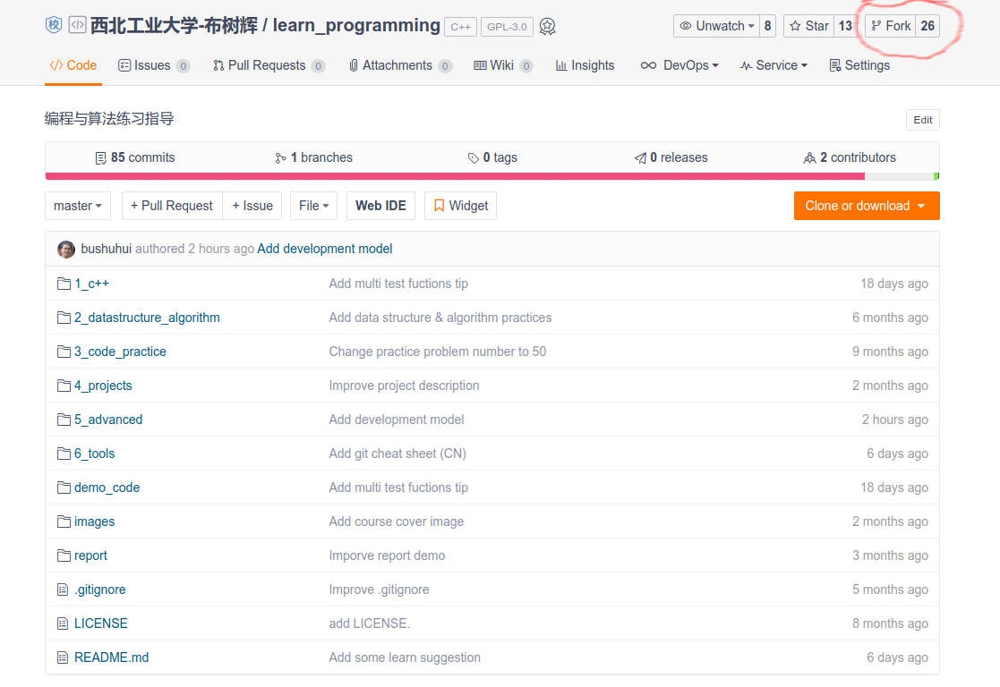
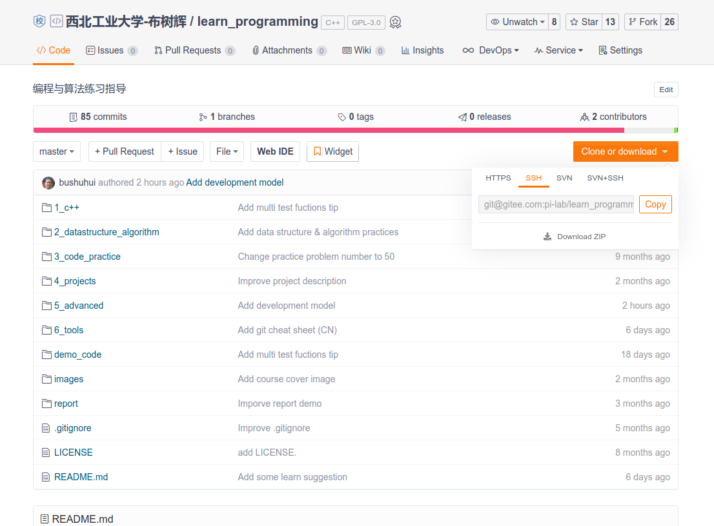

# 如何Fork代码到自己的仓库并clone到本地

## 0. [如何快速的注册账号并完成第一次提交](https://gitee.com/help/categories/19)

### 1) [注册 Gitee 账号](https://gitee.com/help/articles/4113)

目前 Gitee 提供了面向个人开发者的「社区版」和面向企业研发团队的「企业版」服务，支持 Git/SVN 管理，提供代码审核、Bug 跟踪以及 Webhook 钩子回调等功能，开发者可以在 G...

### 2) [创建你的第一个仓库](https://gitee.com/help/articles/4120)

在注册完成并成功登录码云账号后，用户可以开始创建自己的第一个仓库。 1、通过网站右上角的「+」号，选择「新建仓库」，进入新建仓库页面 新建仓库 2、在新建仓库页面填写仓库信息。仓库相关概念说明...

### 3) [提交第一行代码](https://gitee.com/help/articles/4122)

在创建完仓库之后，用户可以通过如下方式，可以向仓库提交第一行代码。 此处我们以用户账号下命名为 HelloGitee 的仓库为例。对应的仓库地址为：https://gitee.com/用户个性地...

## 1. 如下图所示，点击红色圈圈部分的`Fork`

## 2. 如何clone代码

[git clone / 下载代码](https://gitee.com/help/articles/4192#article-header0)

