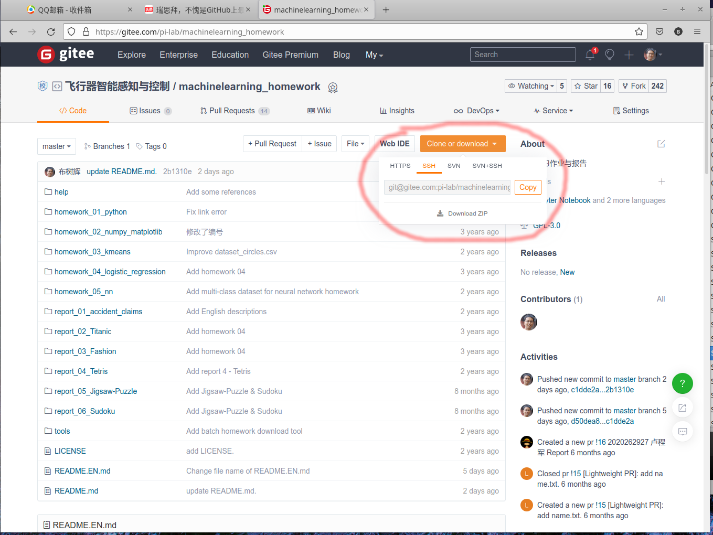

# 如何Fork代码到自己的仓库并clone到本地

详见 [如何快速的注册账号并完成第一次提交](https://gitee.com/help/categories/19)

## 1. [注册 Gitee 账号](https://gitee.com/help/articles/4113)

如果没有注册Gitee账户，先注册一个账户。按照[注册 Gitee 账号](https://gitee.com/help/articles/4113)的说明操作。


## 2. [安装Git软件，配置环境](README.md)

按照[安装Git软件，配置环境](README.md)，进行如下操作：
1. 安装 Git
2. 配置个人的基本信息
3. 设置SSH公钥


## 3. Fork仓库到自己的参考

如下图所示，点击红色圈圈部分的`Fork`


## 4. clone参考到本地

[git clone / 下载代码](https://gitee.com/help/articles/4192#article-header0)




## 5. [提交第一行代码](https://gitee.com/help/articles/4122)

在自己的本地仓库进行修改，确认无误后，进入到本地参考的目录，执行
```
git add -A
git commit -m "Message"
git push origin master
```

如果遇到问题，可以使用如下命令排查错误
```
# 查看仓库的服务器地址，确认是否是自己的地址；否则不是自己的仓库，没有权限push
git remote -v

# 查看仓库的具体信息
git status
```


