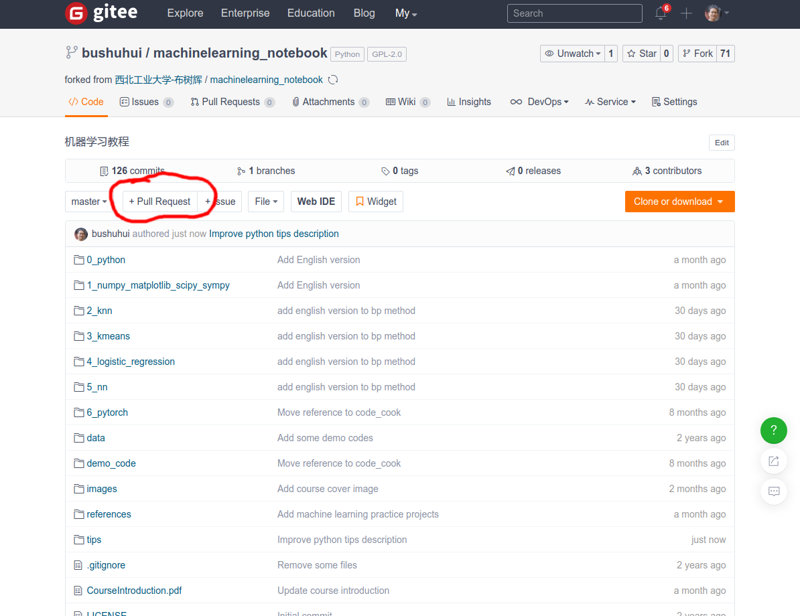
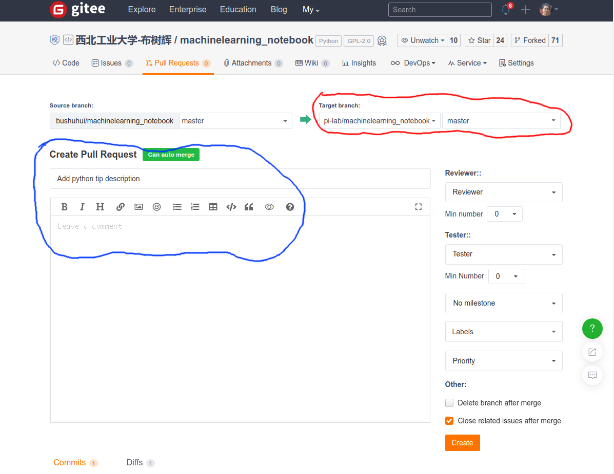

# 如何申请Pull Request

按照Git的标准操作，一般是自己Fork一个项目，然后在自己Fork项目里进行操作，如果希望将自己做的修改让母项目（之前被Fork的那个项目）更新，则可以通过Pull Request完成。通过发起`Pull Request`，母项目的开发人员可以通过Pull你自己项目的改动，从而将你的改进合并到母项目中。

为什么这么做？“Pull Request”是一种通知机制，你修改了他人的代码，将你修改通知原来的作者，希望他合并你的修改，这就是Pull Request。Pull Request本质上是一种软件合作方法，是将涉及不同功能的代码，纳入主干的一种流程。这个过程中，还可以进行讨论、审核和修改代码。更详细的说明可以参考[《Github中Pull Request操作》](https://www.jianshu.com/p/a31a888ac46b) (虽然讲的是Github，但是Gitee上的操作是类似的)

关于如何Fork，如何clone代码，可以参考[《如何Fork代码到自己的仓库并clone到本地》](HowToForkClone.md)


## 1. 在Fork的项目的本地修改代码，然后提交到服务器

```
git add -A
git commit -m "Improve some descriptions"
git push origin master
```


## 2. 进入自己项目，选择`+Pull Request`

在gitee网站上，自己项目的主页上，找到`+Pull Request`（下图中红色标注的地方），然后点击




## 2. 选择Target branch, 填写请求的说明

* 选择目标分支信息，默认是母项目的仓库，`master`分支（下图中红色标注的，一般情况下不需要改）
* 填写请求的说明（下图中蓝色标注的，简明写出改进了什么，做了什么等等）
* 然后点击页面右下方的`Create`




## 3. 等待母项目开发人员确认并采纳

* 如果你做的修改得到了母项目开发人员的认可，则他会将你做的修改合并进入到母项目

* 如果他认为你做的不够好，则有可能会给你反馈，你根据反馈作为修改，然后再操作一次`Pull Request`