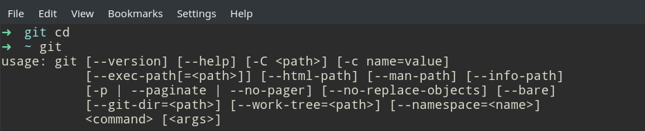

# Git使用教程

## 1. 安装与配置
### 1.1 安装 Git
Windows操作系统：首先下载 https://pc.qq.com/detail/13/detail_22693.html ；然后安装到自己的电脑中。

Linux操作系统下，在终端命令行输入git（PS:以下的命令输入基本都在终端进行）

 

上图表明我的电脑已安装git。若提示git未安装，按照以下命令提示安装。

```
sudo apt-get install git
```

若提示`unable to locate package git`，可能是新装的ubuntu系统没有update,输入`sudo apt-get update`命令，再重复命令`sudo apt-get install git`即可。

### 1.2 配置个人的基本信息
在WIndows下，运行Git的命令行；在Linux下打开命令行终端

输入命令：
```
git config --global user.name <username>
git config --global user.email <email>
```

此步是自报家门：姓名（上例中的`<username>`要替换成你自己的名字）和邮箱地址（上例中的`<email>`，替换成自己邮箱)，这里的名字和邮箱最好是gitee上的保持一致。

`git config`命令的`--global`参数，表明本地电脑所有的git仓库都会使用此配置，当然可以对特定的仓库指定不同的用户名和邮箱。后续的操作都会标记并使用上面设置的用户名和邮箱。

### 1.3 设置SSH公钥
使用SSH提交代码到服务器使用公钥来识别用户身份，因此免去了用户名、密码的输入。

Windows下，在`Git GUI Here`里面的，菜单`Help` - `Show SSH Key`生成SSH公钥，然后把SSH公钥拷贝到粘贴板里。

Linux下，运行下面的命令生成SSH公钥：
```
ssh-keygen -t rsa -C "youremail@xxx.com"
```
然后一路回车，这个会在当前用户文件夹下，生成`~/.ssh`文件夹，里边有个`id_rsa.pub`文件，用文本编辑器（记事本）打开，复制其中的全部内容。 

然后打开 https://gitee.com/profile/sshkeys 页面,在该页面中添加公钥,标题可以随便填,公钥就是刚才复制过的内容,然后保存即可。


## 2. 操作已有的仓库的项目

### 2.1 Clone项目到自己的项目
具体见 [如何Fork代码到自己的仓库并clone到本地](https://gitee.com/pi-lab/learn_programming/blob/master/6_tools/git/HowToForkClone.md)


### 2.2 Clone项目到本地
在自己项目的页面，找到“Clone or download”，根据需要选择SSH，或者HTTPS网址，然后在本地命令行执行如下命令，可以参考[操作页面示例](https://gitee.com/pi-lab/learn_programming/blob/master/6_tools/git/pic_git/git_clone_code.png)
```
git clone git@192.168.1.3:pi-lab/PIL2.git
```

### 2.3 增加、编辑代码
对本地代码、文件进行编辑、操作


### 2.4 将服务器最新代码下载到本地
为了防止服务器上的代码其他人更改，可以现在推送本地文件到服务之前，将服务器最新代码更新到本地
```
git pull origin master
```

### 2.5 增加、提交到本地仓库
```
git add -A
git commit -m "comments to this revision"
```

### 2.6 提交到服务器
```
git push origin <branchname>
```
其中`<branchname>`一般是`master`


## 3. 创建新的仓库

### 3.1 创建本地仓库
进入到想要设置成为仓库的目录，然后打开终端，或者`Git BASH`。输入下面的命令
```
git init
```

### 3.2 在Gitee上新建项目
登录自己的账号，然后点击Gitee页面的右上角`+`，选择`新建仓库`

输入`仓库名称`（最好是英文），`路径`（必须是英文），以及`仓库介绍`

### 3.3 关联本地仓库与服务器仓库
进入新建的本地仓库，然后输入下面的命令
```
git remote add origin git@gitee.com:pi-lab/project_name.git
```

### 3.4 增加、编辑文件，提交到仓库
在本地文件夹操作，可以增加文件、编辑问题

查看那些文件做了修改
```
git status
```

然后提交到本地仓库
```
git add -A
git commit -m "Message"
```

提交到服务器
```
git push origin master
```


## 4. 操作分支


### 4.1 创建自己的分支（new branch）
```
git checkout -b <branchname>
```

### 4.2 合并其他分支的代码 （高级用法）
```
# 将服务器上的dev分支合并到本地的分支
git pull origin dev
    
# fix some conflicts when occurred，可能会存在冲突，修改冲突
    
# 将修改提交到本地仓库
git add -A
git commit -m "comments to this revision"

# 提交到远端服务器
git push origin <branchname>
```

### 4.3 合并目前代码到`dev`或者`master`分支 （高级用法）
```
git checkout dev
git merge <branchname>
    
# fix some conflicts when occurred，可能会存在冲突，修改冲突
    
git add -A
git commit -m "comments to this revision"

git push origin dev
```


## 5. 小技巧

### 5.1 Discard current modification
```
git log # to see which revision want to back, and get the number, eg. "bdc6980"
    
git reset --hard "bdc6980"
```


### 5.2 Submodule

1. Add submodule to current project
```
git submodule add 仓库地址 路径

# 即

git submodule add https://android.googlesource.com/platform/frameworks/volley extras
```

2. Update:

如果过了一段时间volley库有更新，这时候我们的app也需要更新，命令如下：
```
git submodule update
```

3. Delete

submodule的删除稍微麻烦点：首先，要在“.gitmodules”文件中删除相应配置信息。然后，执行“git rm –cached ”命令将子模块所在的文件从git中删除。
        
4. 下载的工程带有submodule

当使用git clone下来的工程中带有submodule时，初始的时候，submodule的内容并不会自动下载下来的，此时，只需执行如下命令：
```
git submodule update --init --recursive
```
即可将子模块内容下载下来后工程才不会缺少相应的文件。

### 5.3 git使用proxy
设置git的代理服务器
```
git config --global https.proxy 'http://127.0.0.1:8888'
```

或者在`~/.gitconfig`里面加入下面的语句，通过代理服务器访问github。其中1081是代理服务器的端口（可也以是1082, 1083, 1084)
```
[http "https://github.com"]
	proxy = socks5://192.168.1.4:1081
```

### 5.4 git命令行显示中文
将git 配置文件 core.quotepath项设置为false。quotepath表示引用路径
```
git config --global core.quotepath false
```


## 其他


## 参考资料

基础教程
* [Git快速入门 - Git初体验](https://my.oschina.net/dxqr/blog/134811)
* [在Win7系统下使用TortoiseGit(乌龟git)简单操作Git](https://my.oschina.net/longxuu/blog/141699)


系统教程
* [Git简明教程.md](git简明教程.md)
* [Git教程.pdf](Git教程.pdf)
* [Git系统学习 - 廖雪峰的Git教程](https://www.liaoxuefeng.com/wiki/0013739516305929606dd18361248578c67b8067c8c017b000)


实验室常用功能介绍
* [PILAB的Git使用教程](Git使用教程_PILAB.pdf)
* [如何Fork代码到自己的仓库并clone到本地](HowToForkClone.md)
* [如何在Gitee添加其他用户](gitee_addmember.md)


参考手册等
* [Git Cheatsheet](git-cheatsheet.pdf)
* [Git常用命令](git-cheatsheet_cn.jpg)


## 好用的工具
* [GitKraken](https://www.gitkraken.com/) - Git Client
