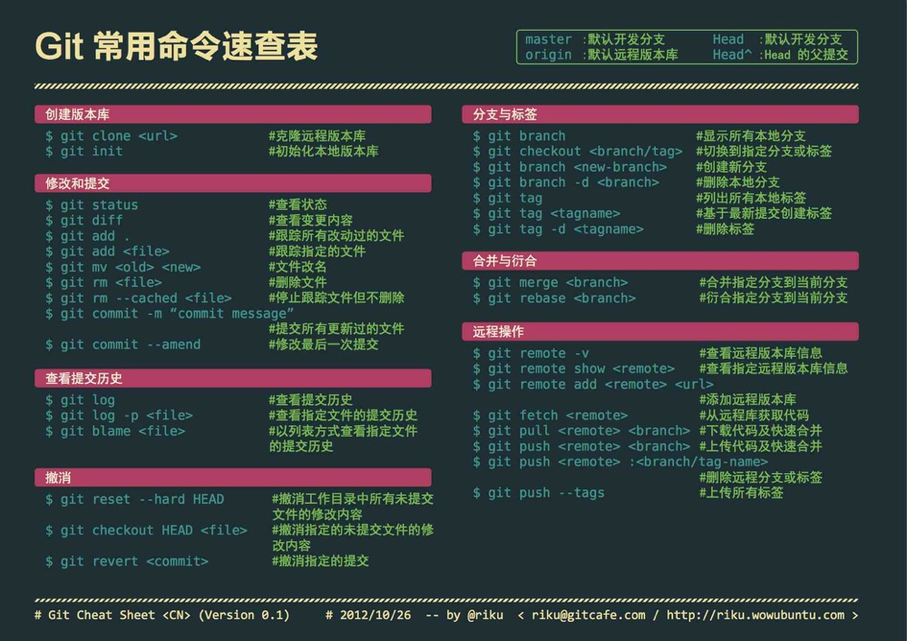

## Git使用教程
* [Git Tips - 常用方法速查，快速入门 （强烈推荐初学者，或者查命令）](git-tips.md)

基础教程
* [Git快速入门 - Git初体验](https://my.oschina.net/dxqr/blog/134811)
* [在Win7系统下使用TortoiseGit(乌龟git)简单操作Git](https://my.oschina.net/longxuu/blog/141699)

系统教程
* [Git简明教程.md](git简明教程.md)

* [Git教程.pdf](Git教程.pdf)

* [Git系统学习 - 廖雪峰的Git教程](https://www.liaoxuefeng.com/wiki/0013739516305929606dd18361248578c67b8067c8c017b000)

  

实验室常用功能介绍
* [PILAB的Git使用教程](Git使用教程_PILAB.pdf)
* [如何Fork代码到自己的仓库并clone到本地](HowToForkClone.md)
* [如何在Gitee添加其他用户](gitee_addmember.md)

参考手册等
* [Git Cheatsheet](git-cheatsheet.pdf)
* [Git常用命令](git-cheatsheet_cn.jpg)

## Git常用命令速查

## 好用的工具

* [GitKraken](https://www.gitkraken.com/) - Git Client
