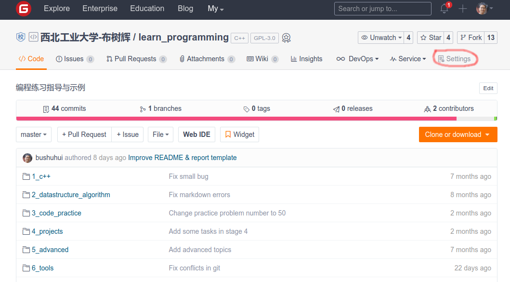
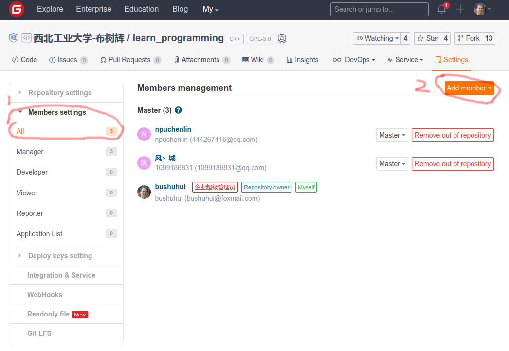
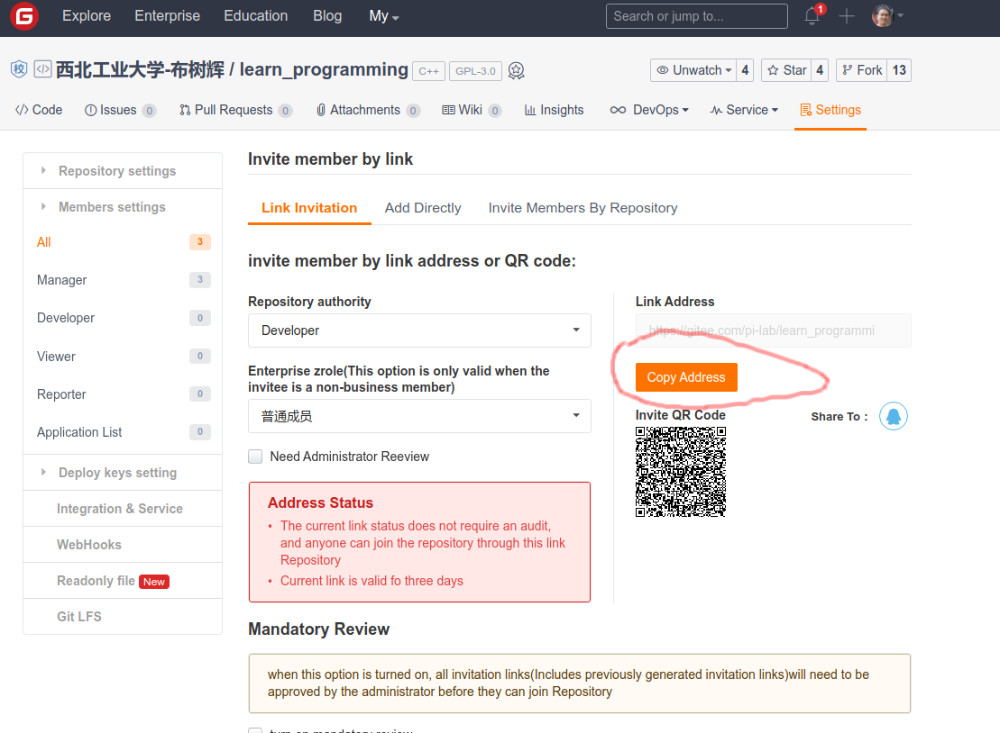

# 如何在Gitee项目中添加成员

为了方便大家协同开发、或者方便修改等，需要多人同时操作一个代码仓库。这就需要给代码仓库增加除了自己之外的人增加用户权限，具体的操作步骤如下：

## step1： 点击下面图片中右上角的`settings`菜单

## step2： 点击左侧的菜单栏中的`Members settings` - `All`，然后点击右侧上方的`Add member`

## step3： 生成邀请链接，并发送
点击右侧的`Copy Address`，将这个邀请地址发给 bushuhui@nwpu.edu.cn 

