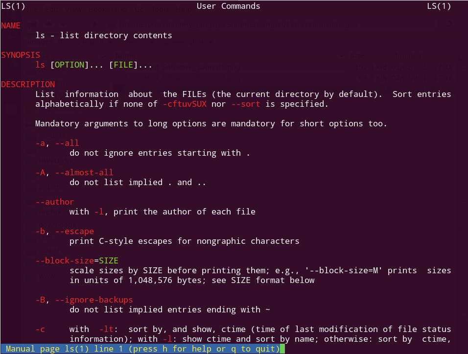
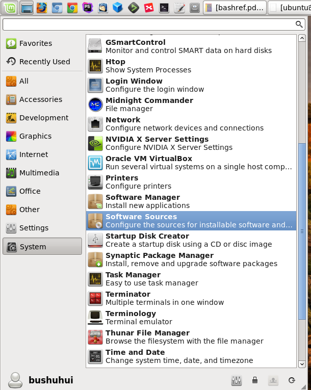
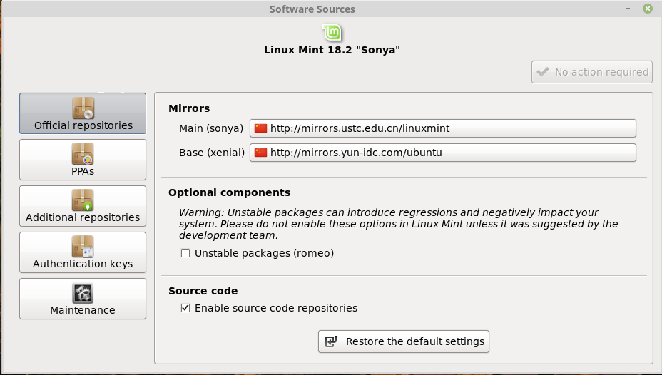

# Linux入门

## 1. 概述
### 1.1 为什么要学习和使用Linux

如果不知道到为什么，不理解，那么就先尝试去学习，并努力去使用，**搞研究和开发的大牛都在用，所以一定有其内在的道理**。需要强迫自己用上一段时间Linux来进行程序开发，文档编写等等。当你习惯了之后就会很清楚的知道为什么了。所以在学习过程中，对待一些新的东西要抱有同样的思维，要先去尝试，再去发现其特点，而不是直接拒绝。

在Linux学习过程，刚开始需要记忆常用的命令，多反思这些命令灵活的组合。

### 1.2 使用Linux的好处
虽然刚开始使用Linux会发现到处都是坑，处处都能遇到问题，但是当你一旦会使用之后你就会发现Linux有非常多的优点，足以弥补你之前解决问题所花的时间。

目前在计算机视觉、机器学习，计算机的大多数领域，Linux提供了大量的开源代码和工具，通过一个简单的命令行就可以自动的完成大多数软件的安装，能够极大的节省自己的时间（但前提是你需要知道如何找到这些软件名字）；此外，Linux下面没有烦人的弹出框，能让你更加集中精力在学习和工作上。

主要的优点：
1. 有大量的开源程序、软件
2. 通过一个命令行能够安装你所需要的软件
3. 可以编写脚本，自动执行非常复杂的任务
4. 机器学习的大部分的程序需要在Linux运行，避免大量移植代码到Windows下所可能遇到的问题
5. 系统比较纯净，一般不需要安装杀毒软件，同样的配置Linux下执行大部分软件更流程


### 1.3 安装Linux
第一次使用Linux，并且安装Linux会是一个比较难、会遇到很多问题的过程。但是需要坚持下来，因为这个过程会学到很多解决实际问题的经验。在这个过程琢磨如果遇到问题，怎么去找解决办法等等。

下载安装的ISO文件，可以通过国内镜像网站下载：
* https://mirrors.tuna.tsinghua.edu.cn/ubuntu-cdimage/
* https://developer.aliyun.com/mirror/ 点击`OS镜像`，然后选择版本


建议参考下面的说明文档：
* [Ubuntu安装最佳实践（防踩坑指南）](https://zhuanlan.zhihu.com/p/114518326)
* [VirtualBox 安装 Ubuntu 开发环境详细图文教程](https://zhuanlan.zhihu.com/p/35619204)

由于直接使用系统默认的源比较慢，所以安装好系统之后，尽快把软件源替换成国内的镜像。
* https://developer.aliyun.com/mirror/ubuntu
* https://mirrors.tuna.tsinghua.edu.cn/help/ubuntu/


## 2. 需要掌握的基本

### 2.1 说明文档中的标注： 
* `<>`表示必须输入参数
* `[]`表示可选的输入参数


### 2.2 `man` 查看命令的使用说明
对于初学者，能够灵活的使用`man`命令，能够极大的提高学习的速度。大多数的Linux命令都有在线的使用手册，因此通过man命令能够让你在不清楚命令参数的情况下，快速的学到用法。

基本的用法是`man <command>`



由于man使用了`vim`的键盘设置，因此能够使用快捷键来操作

| 按键         | 动作             | 
| --------    | --------        |
| `j`         | 向下翻一行        |
| `k`         | 向上翻一行        |
| `ctrl+d`    | 向下翻一屏        |
| `ctrl+u`    | 向上翻一屏        |
| `/keyword`  | 搜索关键词keyword |
| `n`         | 下一个搜索关键词出现的地方 |
| `N`         | 上一个搜索关键词出现的地方 |
| `gg`        | 说明文档的最上面   |


## 3. 基本的命令


### 1) `ls` 查看当前目录里的文件
```
SummerCamp2018@T470p> ls
ai/  cpp/  python/  slam/  tool/  book.json  contribute.md  README.md  SUMMARY.md
```
或者是 `ll`, `ll`在大多数系统下是 `ls -a`的别名
```
SummerCamp2018@T470p> ll
total 28
drwxrwxr-x 8 bushuhui bushuhui    93 Mar  1 11:17 ai/
drwxrwxr-x 5 bushuhui bushuhui    41 Mar  1 11:17 cpp/
drwxrwxr-x 5 bushuhui bushuhui    51 Mar  1 11:17 python/
drwxrwxr-x 7 bushuhui bushuhui    88 Mar  1 11:17 slam/
drwxrwxr-x 9 bushuhui bushuhui   103 Mar  1 11:17 tool/
-rw-rw-r-- 1 bushuhui bushuhui  2427 Mar  1 11:17 book.json
-rw-rw-r-- 1 bushuhui bushuhui  1011 Mar  1 11:17 contribute.md
-rw-rw-r-- 1 bushuhui bushuhui 13133 Mar  1 11:17 README.md
-rw-rw-r-- 1 bushuhui bushuhui  2892 Mar  1 11:17 SUMMARY.md
```

### 2) `cd` 切换到一个指定的目录，或者进入`home`目录

进入到一个目录
```
SummerCamp2018@T470p> ls
ai/  cpp/  python/  slam/  tool/  book.json  contribute.md  README.md  SUMMARY.md
SummerCamp2018@T470p> cd tool/linux/
linux@T470p> ls
docs/  exercise/  linux.pptx*  README.md
```

进入到`home`目录
```
linux@T470p> cd
~@T470p> pwd
/home/bushuhui
```

进入到上一次的目录
```
cd -
```

### 3) `pwd`显示当前所在的目录
```
linux@T470p> pwd
/home/bushuhui/my_progs/pi/SummerCamp2018/tool/linux
```

### 4) `df`显示磁盘的空间, `df -h`显示的空间使用易读的格式，`df -T`显式分区的格式
```
linux@T470p> df 
Filesystem             1K-blocks        Used  Available Use% Mounted on
udev                    16271160           0   16271160   0% /dev
tmpfs                    3258776       16452    3242324   1% /run
/dev/sdb5               32948792    15714300   15537740  51% /
/dev/sda1             1952559696  1592453160  360106536  82% /home
linux@T470p> 
linux@T470p> df -h
Filesystem            Size  Used Avail Use% Mounted on
udev                   16G     0   16G   0% /dev
tmpfs                 3.2G   17M  3.1G   1% /run
/dev/sdb5              32G   15G   15G  51% /
/dev/sda1             1.9T  1.5T  344G  82% /home
```

### 5）`mkdir`生成一个目录
```
linux@T470p> mkdir tem
linux@T470p> ls
docs/  exercise/  tem/  linux.pptx*  README.md
```

`mkdir -p <path/to/folder>`生成一个到指定多层目录

### 6）`rm`删除文件，或者`rm -r`删除目录

```
linux@T470p> touch test
linux@T470p> ls
docs/  exercise/  linux.pptx*  README.md  test
linux@T470p> rm test
```
其中的`touch`是生成一个空文件的指令。

删除一个目录
```
linux@T470p> rm -r tem
linux@T470p> ll
total 396
drwxrwxr-x 2 bushuhui bushuhui    268 Mar  2 11:19 docs/
drwxrwxr-x 2 bushuhui bushuhui     23 Mar  1 11:17 exercise/
-rwxrwxr-x 1 bushuhui bushuhui 401292 Mar  1 11:17 linux.pptx*
-rw-rw-r-- 1 bushuhui bushuhui   2757 Mar  2 15:06 README.md
```

### 7) `find`找到一个特定的文件

找当前目录下所有符合正则表达的文件名的文件，`find -name *pdf`
```
linux@T470p> find -name *pdf
./docs/Bash-Beginners-Guide.pdf
./docs/bashref.pdf
./docs/Linux_Complete_Command_Line.pdf
./docs/unixtoolbox.pdf
./docs/unix_toolbox_cn.pdf
./docs/鸟哥的Linux私房菜基础篇-第三版.pdf
./docs/ubuntu命令行简明教程.pdf
```

找到给定目录下所有修改时间在2天之内的文件 `find . -mtime -2`
```
linux@T470p> find .  -mtime -2
.
./docs
./docs/Bash-Beginners-Guide.pdf
./docs/bashref.pdf
./exercise
./exercise/README.md
./linux.pptx
./README.md
```

找到文件之间执行特定的命令，例如删除：`find . -type f -mtime -2 | xargs rm -rf`
```
linux@T470p> find . -type f -mtime -2 
./linux.pptx
./README.md
./docs/Bash-Beginners-Guide.pdf
./docs/bashref.pdf
./exercise/README.md
linux@T470p> find . -type f -mtime -2 | xargs rm -rf
linux@T470p> find . -type f -mtime -2 
linux@T470p> 
```

### 8）`locate`在整个文件系统查找某个特定的文件
```
linux@T470p> locate -b linuxmint # 其中-b表示只是找文件名中包含指定字符串的文件
/etc/linuxmint
/etc/default/grub.d/50_linuxmint.cfg
/etc/lightdm/lightdm-gtk-greeter.conf.d/99_linuxmint.conf
/etc/lightdm/lightdm.conf.d/70-linuxmint.conf
/home/bushuhui/.linuxmint
...
```

也可以通过管道来配合`grep`过滤
```
linux@T470p> locate linuxmint | grep iso # 通过 grep 过滤只留下包含iso的文件
/home/soft/os-system/cd-images/linuxmint-17.1-cinnamon-64bit.iso
/home/soft/os-system/cd-images/linuxmint-17.2-xfce-64bit.iso
/home/soft/os-system/cd-images/linuxmint-18.1-xfce-64bit.iso
/home/soft/os-system/cd-images/linuxmint-18.2-xfce-64bit.iso
...
```

### 9）`grep`全文搜索、过滤命令。该命令通常会合`find`等联合起来使用。

所有当前目录下所有包含特定字符串的文件
```
linux@T470p> grep -r linuxmint
README.md:linux@T470p> locate -b linuxmint # 其中-b表示只是找文件名中包含指定字符串的文件
README.md:/etc/linuxmint
README.md:/etc/default/grub.d/50_linuxmint.cfg
README.md:/etc/lightdm/lightdm-gtk-greeter.conf.d/99_linuxmint.conf
README.md:/etc/lightdm/lightdm.conf.d/70-linuxmint.conf
README.md:/home/bushuhui/.linuxmint
...
```

`grep -i <str>`表示不区分大小写，例如：
```
linux@T470p> grep -r -i PDF
Binary file docs/Bash-Beginners-Guide.pdf matches
docs/unixtoolbox.pdf:%PDF-1.4
docs/unixtoolbox.pdf:<</Title (PDF to Jpeg and concatenate PDF files)
Binary file docs/unixtoolbox.pdf matches
...
```

### 10) `ln`创建链接到特定文件，不过一般都使用`-s`来创建符号链接。

*使用这个命令的好处是不用将文件拷贝一份，可直接将其放置到另外一个目录中。*
```
linux@T470p> ln -s docs/unixtoolbox.pdf unixtoolbox.pdf
linux@T470p> ll
total 400
drwxrwxr-x 2 bushuhui bushuhui    268 Mar  2 11:19 docs/
drwxrwxr-x 2 bushuhui bushuhui     23 Mar  1 11:17 exercise/
-rwxrwxr-x 1 bushuhui bushuhui 401292 Mar  1 11:17 linux.pptx*
-rw-rw-r-- 1 bushuhui bushuhui   7695 Mar  2 15:35 README.md
lrwxrwxrwx 1 bushuhui bushuhui     20 Mar  2 15:37 unixtoolbox.pdf -> docs/unixtoolbox.pdf
```

### 11）`sudo`临时切换身份到root
Debian, Ubuntu， LinuxMint等系统默认是不让直接使用root身份，所以安装软件、或者操作系统文件的时候需要临时切换身份。

**重要！！！重要！！！ 直接使用会导致操作系统被损坏，而且直接使用root这个习惯非常恶劣！需要养成不使用root的习惯！**

安装软件：
```
sudo apt-get install p7zip-full
```

临时切换成管理员：
```
sudo su
```

## 4. 打包、解压缩命令

### 1） `tar`将目录打包成一个文件，如果目录里面有很多碎文件，打包后方便拷贝。

* 打包的命令：`tar cf <dest_tar.tar> <files> [foldes]`
* 解包的命令：`tar xf <tarfile.tar>`


打包：
```
tool@T470p> tar cf linux.tar linux
tool@T470p> ls
docker/  docmanage/  git/  latex/  linux/  markdown/  xmind/  linux.tar
```

解包：
```
tem@T470p> tar xf linux.tar 
tem@T470p> 
```


### 2） `gzip`， `bzip2`, `7za` 压缩、解压

可以使用`gzip`来压缩打包的文件：
* 打包的命令：`tar czf <dest_tar.tar.gz> <files> [foldes]`
* 解包的命令：`tar xzf <tarfile.tar.gz>`

也可以使用`bzip2`来压缩打包的文件：
* 打包的命令：`tar cjf <dest_tar.tar.bz2> <files> [foldes]`
* 解包的命令：`tar xjf <tarfile.tar.bz2>`


*Linux下面压缩的文件可能会在Windows出现乱码*,所以如果需要将压缩发给其他人时，考虑7za。安装`7za`可以通过命令行：`sudo apt-get install p7zip-full`

* 打包的命令：`7za a <archieve_name> <files> [foldes]`
* 解包的命令：`7za x <archieve_name>`


## 5. 软件管理

使用Linux最方便的优点是通过包管理可以快速的安装所需要的软件，因此极大的提高研究的效率。由于研究人员主要使用Ubuntu系列的软件，所以我们只需要学习`apt-get`系列的命令，如果有精力可以学习`yum`方面的命令（主要用在网络服务器上，我们使用的非常少）。


### 1) `apt-cache search`查找有那些软件包
例如查找Lapack相关的安装包
```
tem@T470p> apt-cache search lapack
libblas-dev - Basic Linear Algebra Subroutines 3, static library
libblas3 - Basic Linear Algebra Reference implementations, shared library
libcholmod3.0.6 - sparse Cholesky factorization library for sparse matrices
liblapack-dev - Library of linear algebra routines 3 - static version
liblapack-doc - Library of linear algebra routines 3 - documentation (HTML)
...
```


### 2) `apt-get install`安装软件包
通过`apt-cache search`找到需要安装的软件包的名字之后，就可以通过`sudo apt-get install`来安装软件。
```
tem@T470p> sudo apt-get install libatlas-dev
Reading package lists... Done
Building dependency tree       
Reading state information... Done
The following packages were automatically installed and are no longer required:
  apt-show-versions libauthen-pam-perl php7.0 php7.0-cli php7.0-dev php7.0-fpm php7.0-json php7.0-opcache php7.0-readline shtool
Use 'sudo apt autoremove' to remove them.
The following additional packages will be installed:
  gfortran gfortran-5 libblas-dev libgfortran-5-dev
...
```


### 3) `apt-get purge`删除软件包
如果那个软件包不再需要了，可以通过`sudo apt-get purge`来删除。
```
tem@T470p> sudo apt-get purge libatlas-dev
Reading package lists... Done
Building dependency tree       
Reading state information... Done
0 upgraded, 0 newly installed, 1 to remove and 86 not upgraded.
After this operation, 297 kB disk space will be freed.
Do you want to continue? [Y/n] y
(Reading database ... 324008 files and directories currently installed.)
Removing libatlas-dev (3.10.2-9) ...
```


### 4) `dpkg -l`查看系统中按照了那些软件包
```
tem@T470p> dpkg -l | grep lapack
ii  liblapack3                                    3.6.0-2ubuntu2                               amd64        Library of linear algebra routines 3 - shared version
```


### 5) `dpkg -L <package_name>`查看包具体安装到了文件系统的哪里
```
tem@T470p> dpkg -L liblapack3
/.
/usr
/usr/lib
/usr/lib/lapack
/usr/lib/lapack/liblapack.so.3.6.0
/usr/share
/usr/share/doc
/usr/share/doc/liblapack3
/usr/lib/lapack/liblapack.so.3
/usr/share/doc/liblapack3/changelog.Debian.gz
```


### 6) 设置软件源，提高安装的速度
由于默认Ubuntu，LinuxMint使用国外的源所以访问速度比较慢，可以通过设置使用国内的镜像网站来加快安装软件的速度。具体的操作如下：

1. 进入软件源的设置“System - Software Sources"



2. 选择Main, Base的镜像为国内的服务器



## 6. 管道符号|之后的常用命令

### 1） `more` 如果显示的内容太多，可能分屏显示
例如 `cat README.md | more`, 其中的`cat`是把文本文件输出到终端
```
SummerCamp2018@T470p> cat README.md | more
# 智能系统实验室-2018新人暑期培训计划

## 1. 课程目标
随着团队扩大和节奏加快，目前依靠大家自学的方式学习速度已经远远满足不了需求，根据之前的共识和这
时间的思考，我们整理了本方案，计划在明年研究生入学前开展学前强化学习班，旨在快速引导新生入门相
领域，同时也给其后续学习提供系统性的资料。
而在这之前，我们需要号召高年级学生系统性地整理相关资料，通过协作方式完善后试讲，确认OK后整理到
个统一的文件体系中。
```

也可以直接调用`more`来分屏显示文本文件
```
SummerCamp2018@T470p> more README.md 
# 智能系统实验室-2018新人暑期培训计划

## 1. 课程目标
随着团队扩大和节奏加快，目前依靠大家自学的方式学习速度已经远远满足不了需求，根据之前的共识和这
段时间的思考，我们整理了本方案，计划在明年研究生入学前开展学前强化学习班，旨在快速引导新生入门
相关领域，同时也给其后续学习提供系统性的资料。
而在这之前，我们需要号召高年级学生系统性地整理相关资料，通过协作方式完善后试讲，确认OK后整理到
一个统一的文件体系中。
```

### 2） `grep` 搜索、过滤管道的内容
```
SummerCamp2018@T470p> cat README.md | grep linux
|[tool/linux]     |Linux入门，常用工具介绍，Bash命令ShellToolkit，cd,ls,echo,apt,ssh,dpkg,locate等，Bash编程实践|Tutorial||
[tool/linux]: tool/linux/README.md
|1  |[tool/linux]       |[tool/git]           ||
```


## 7. 其他常用命令

### 1） `history` 列出最近的命令
```
tem@T470p> history 
 4031  ls
 4032  ll
 4033  cd conf/
 4034  ls
 4035  ll
 4036  vi enable-php.conf 
 4037  vi fastcgi_params
 ...
```

### 2） `ps`显示进程

```
tem@T470p> ps 
  PID TTY          TIME CMD
 7775 pts/6    00:00:00 ps
30831 pts/6    00:00:00 bash
```

显示所有的进程`ps -ax`
```
tem@T470p> ps -ax
  PID TTY      STAT   TIME COMMAND
    1 ?        Ss     0:17 /sbin/init splash
    2 ?        S      0:00 [kthreadd]
    3 ?        S      0:01 [ksoftirqd/0]
    7 ?        S      8:42 [rcu_sched]
    8 ?        S      0:00 [rcu_bh]
    ...
```

过滤指定的进程`ps -ax | grep <process>`
```
tem@T470p> ps ax | grep kate 
 9252 pts/6    Sl+    0:00 kate
 9340 pts/7    S+     0:00 grep --color kate
```

### 3） `kill` 给指定的进程发送信号，例如杀死进程 `kill -9 <process_id>`

```
tem@T470p> ps ax | grep kate 
 9252 pts/6    Sl+    0:00 kate
 9340 pts/7    S+     0:00 grep --color kate
tem@T470p> kill -9 9252
```

### 4） `which`显示给定程序的目录
```
SummerCamp2018@T470p> which bash
/bin/bash
```


### 5） `alias`显示、设置别名

显示别名：
```
SummerCamp2018@T470p> alias 
alias cal='cal -3'
alias egrep='egrep --color=auto'
alias f='pcmanfm &'
alias fgrep='fgrep --color=auto'
alias g='grep -lr -i '
alias git_ac='git add -A; git commit -m '
```

设置别名：
```
alias g='grep -i'
```

设置的别名为了能够一直起作用，可以放置在`~/.bashrc`里面（如果你用的是bash）


### 6） `env`显示、设置系统变量

显示系统变量：
```
SummerCamp2018@T470p> env
LC_PAPER=zh_CN.UTF-8
XDG_VTNR=7
MANPATH=/opt/texlive/2012/texmf/doc/man:
LESS_TERMCAP_mb=
XDG_SESSION_ID=c2
...
```

设置系统变量：
```
SummerCamp2018@T470p> export AAA=10
SummerCamp2018@T470p> env | grep AAA
AAA=10
```

当然这个系统变量，也可以放置在`~/.bashrc`里面，这样可以一直使用该设置。


## 8. Tips

### 8.1 安装Sogou拼音输入法

更详细的安装说明可以参考: https://pinyin.sogou.com/linux/help.php


1. 打开 系统设置——区域和语言——管理已安装的语言——在“语言”tab下——点击“添加或删除语言”
    - Select Chinese
    
2. 如果在键盘输入法系统中，没有“fcitx”选项时，建议先打开终端手动安装fcitx：
```
sudo apt-get install fcitx
```

3. Download sogou pinyin input at: https://pinyin.sogou.com/linux/

通过命令行安装搜狗输入法
```
sudo dpkg -i sogoupinyin_版本号_amd64.deb
```

如果出现问题，则先执行下述命令:
```
sudo apt-get purge fcitx-ui-qimpanel
sudo apt-get install fcitx-libs libfcitx-qt0
```

4. 注销计算机即可正常使用搜狗输入法


## 9. 课程作业
1. 安装一个Linux到你的电脑，例如LinuxMint，关于如何分区，如何制作安装启动U盘，可以在网上查找资料，或者问问师兄、师姐。
2. 练习上述命令，掌握Linux命令行的精髓。

## References

更多的Linux使用学习材料可以阅读下述资料：

### Linux使用
---
* [鸟哥的linux私房菜](http://cn.linux.vbird.org/linux_basic/linux_basic.php), [PDF版本](docs/鸟哥的Linux私房菜基础篇-第三版.pdf)
* [ubuntu linux命令行简明教程](docs/ubuntu命令行简明教程.pdf)
* [Unix Toolbox](docs/unixtoolbox.pdf), [Unix Toolbox中文版](docs/unixtoolbox_cn.pdf)
* [Linux Mint 18自动安装脚本（里面包含大多数常用软件的名字）](docs/auto_setup_mint_18.sh)

### Bash
---
* [Bash Guide for Beginners](docs/Bash-Beginners-Guide.pdf)
* [BASH 中文文档](docs/bashref.pdf)

- [learn_bash_2021](./learn_bash.md)
