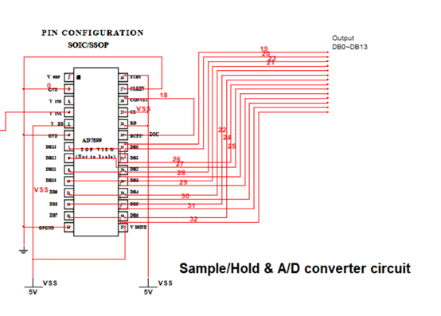

# A brief introduction to human voice recording circuit based on A/D converter chip `AD7899`

<p align="right">  homework file for markdown practice  </p>

[TOC]

## Introduction

***

> Digital signal process can convert the motion of  objects into a series of numbers and gather the useful information by computational methods to satisfy demands in our real life.	——[Baidu Encyclopedia](https://baike.baidu.com/item/数字信号处理/5009?fromtitle=dsp&fromid=74514&fr=aladdin)

### Background

Today, with the advent of highly advanced technology created by scientists like `VoCo` , which can edit sound material in a splendid and high-fidelity  way and artificial intelligence `Siri` and`Cortana` , which can give a response of the appeal and command of users and achieve interaction between human and OS systems, are based upon the most fundamental tool of recognition and analysis of human voice. The high quality sampling are of vital importance.

Here our group are going to introduce our design of our recording circuit based upon A/D converter chip `AD7899` as a direct reflection and illustration of the working pattern of the general recording devices.

### Theory base

In digital recording system, the main process is ***sampling*** and ***quantizing***, where sampling would be *lossless* if sampling frequency is 2 times over target highest frequency, while quantizing must involve *distortions* since digital wave cannot represent all analog wave points, no matter how small the quantization interval is. 

In our experiment, we aim to design such a circuit to reveal the basic composition of modern digital recording circuit and to record human voice. The frequency of human voice ranges from 0 to 2KHz, which is rather low and thus with a low-pass filter of a wide range of protection zone, we can avoid most of the distortions, for example, *phase nonlinearity*, *aliasing*, *resonance* and other problems. 

## Experimental circuit

***

The digital circuit is given as: 




The recording circuit contains 3 main parts: **line amplifier**, **low-pass filter**, and **A/D converter**, which integrated with **Sample/Hold circuit**. As the speaker speaks, the sound signal along with environmental noise  will be converted to analog electric signal by *electret pickup*. After then the signal will be amplified by *line amplifier circuit* to be large enough to be transferred, converted and stored with high accuracy. Then the amplified signal enters *low-pass filter circuit*, where it will be filtered to remove the irrelevant waves (approximately waves over 4 KHz). Then the filtered signal will enter *A/D converter circuit*, which is integrated in AD7899 chip. In A/D converter circuit, it first passes *signal adjustment circuit* to be stable enough to be sampled, then it passes *sample/hold circuit* and finally *A/D converter* to realize the converting process **from analog signal to digital signal**. In brief, our recording circuit will realize the function of converting normal human voices in the form of sound wave to digital electric signal which can be recognized by following process elements, for instance, DSP[^1] , PC, Mixer or storage devices.

```flow
st=>start: start
pu=>inputoutput: Pickpu L/R
e=>end: output
la=>operation: Line amplifier
lf=>operation: Low-pass filter
sh=>operation: Sample/Hold
ad=>operation: A/D converter

st->pu->la->lf->sh->ad->e

```

And the experimental circuit is:


### Line amplifier circuit design

The value of **gain coefficient** is the core of this circuit. To get this value, we may need some calculations as shown below:
$$
50(dB)=20log_{10}{p/p_0}
$$
Where 50 *dB* is the sensitivity of our pickup. And we know p<sub>0</sub> is reference sound pressure level with given value,
$$
p\times{S}=2\times10^{-5};p_0=2\times{10^{-5}}
$$
thus we can get ***gain coefficient=1x10<sup>5</sup>***.

*the rest are skipped*

[^1]:Digital signal processor, a unique micro-processor intending to deal with signal conversion)

