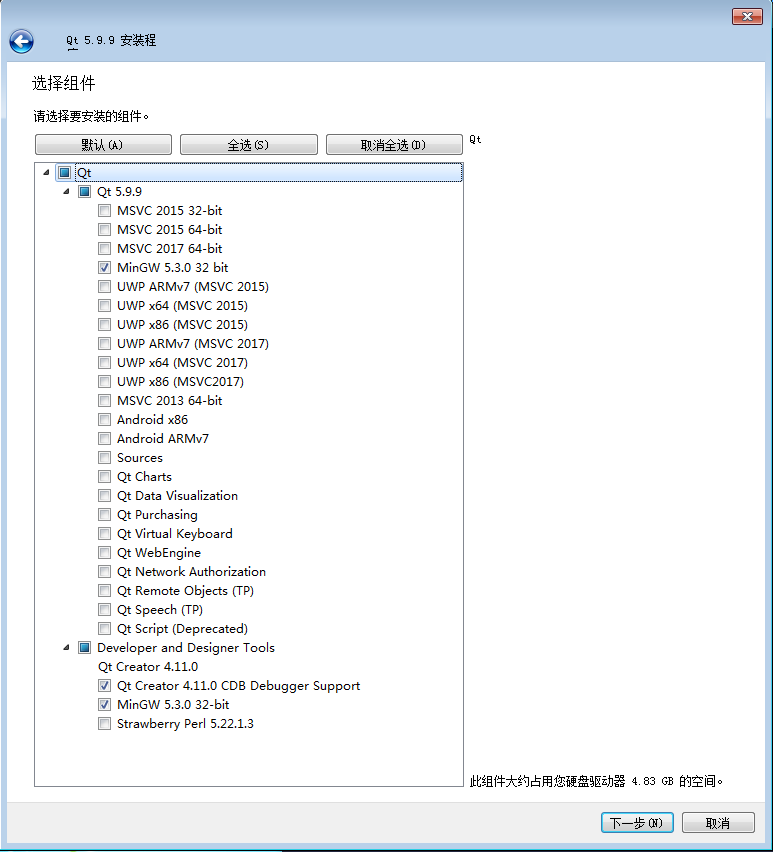

# Qt说明

## 1. 安装Qt

### 1.1 Windows下安装
Step1： 下载Qt的安装文件，下载地址是：
* http://mirrors.sjtug.sjtu.edu.cn/qt/archive/qt/5.9/5.9.9/qt-opensource-windows-x86-5.9.9.exe
* https://mirrors.tuna.tsinghua.edu.cn/qt/archive/qt/5.9/5.9.9/qt-opensource-windows-x86-5.9.9.exe
* http://mirrors.ustc.edu.cn/qtproject/archive/qt/5.9/5.9.9/qt-opensource-windows-x86-5.9.9.exe

Step2：下载完成之后，运行安装程序

Step3：需要注册一个Qt的账号，并利用邮箱验证一下账号

Step4：选择安装组件：选择`Qt 5.9.9 - MingGW 5.3.0 32bit` 和 `Development and Designer Tools - MingGW 5.3.0 32-bit` ，如下图所示：



### 1.2 Linux下安装

如果是Ubuntu系统，执行如下命令：

Qt5安装
```bash
sudo apt install build-essential cmake git gcc g++
sudo apt install qt5-default qt5-qmake-bin
sudo apt install libqt5network5 libqt5sql5 libqt5svg5 libqt5svg5-dev 
```

Qt4安装
```bash
sudo apt-get install libqt4-dev libqt4-opengl-dev
```


## 2. 示例代码

* [Qt示例代码](https://gitee.com/pi-lab/code_cook/tree/master/gui/qt)
* [综合示例项目](https://gitee.com/pi-lab/code_cook/blob/master/DemoProjects.md)

## 3. 学习资料
* [《Qt学习资料汇总》](https://gitee.com/pi-lab/code_cook/blob/master/gui/qt/README.md)