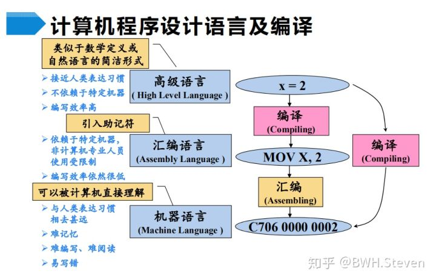

# 编译原理

理解编译器内部原理，可以让你更高效利用它。按照编译的工作顺序，逐步深入编程语言和编译器是怎样工作的。本文有大量的链接、样例代码和图表帮助你理解编译器。

* [编译原理入门笔记](https://zhuanlan.zhihu.com/p/130702001)
* [编译原理入门篇](https://www.cnblogs.com/fisherss/p/13905395.html)
* [人人都能读懂的编译器原理](https://zhuanlan.zhihu.com/p/53336801)

## GCC 工具链

* gcc / g++

* 静态库

* 动态库

* ldd

* nm

* readelf

    
