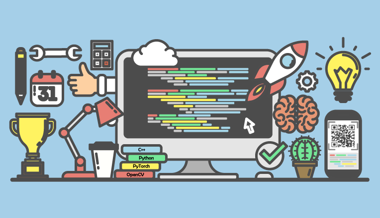

# 一步一步学编程

本教程的主要目的是引导大家通过合理的过程和步骤，一步一步掌握编程的理论与技巧，提高学习的效率和效果，并降低学习过程的痛苦指数。和其他传统的教程不同之处主要在于：1) 使用Git来记录学习过程的代码、心得：保存学习过程的进度，能够更好的师生互动; 2) 本教程只提供了学习大纲，需要找适合自己的教程，并自己设计学习进度和安排。**请有志于机器学习，计算机视觉的同学脚踏实地的把基础打扎实之后再开始相关专业知识的学习。**

注意：
* ***本教程主要是培养并锻炼算法思维，如果只是简单的抄别人的代码，毫无意义，所以大家宁愿慢一点也不要抄！！！***
* ***关于本教程的说明，请认真阅读三遍以上！***

* [一、为何学习编程？](README-1.md)
* [二、如何学习？](README-2.md)
* [三、如何提交作业，如何使用Git，Markdown](README-3.md)
* [四、学习的建议](README-4.md)

## 五、相关学习资料参考

在上述内容学习完成之后，可以进行机器学习、计算机视觉方面的学习与研究，具体的资料可以参考：
1. 飞行器智能感知与控制实验室 - 培训教程与作业
    - [《飞行器智能感知与控制实验室-暑期培训教程》](https://gitee.com/pi-lab/SummerCamp)
    - [《飞行器智能感知与控制实验室-暑期培训作业》](https://gitee.com/pi-lab/SummerCampHomework)
2. 机器学习教程与作业
    - [《机器学习教程》](https://gitee.com/pi-lab/machinelearning_notebook)
    - [《机器学习课程作业》](https://gitee.com/pi-lab/machinelearning_homework)
3. [《一步一步学SLAM》](https://gitee.com/pi-lab/learn_slam)
4. [飞行器智能感知与控制实验室-研究课题](https://gitee.com/pi-lab/pilab_research_fields)
5. [编程代码参考、技巧集合](https://gitee.com/pi-lab/code_cook)
    - 可以在这个代码、技巧集合中找到某项功能的示例，从而加快自己代码的编写

工具的使用教程等

* [Code Cook - 编程参考代码，技巧集合](https://gitee.com/pi-lab/code_cook)
* [Linux](6_tools/linux)
* [Markdown](6_tools/markdown)
* [Git](6_tools/git)
* [CMake](6_tools/cmake)

